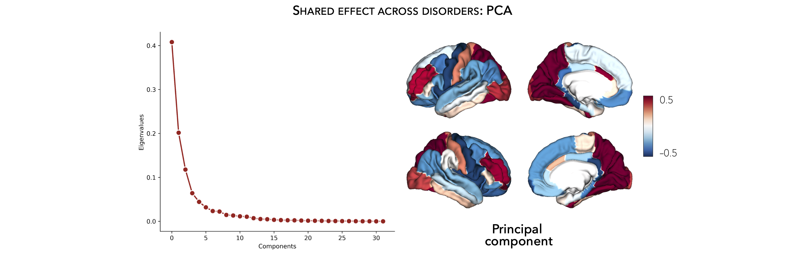
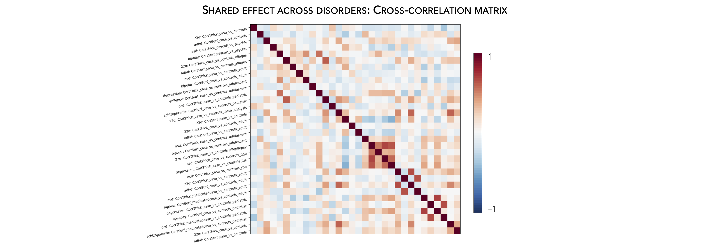

.. _cross_disorder:

.. title:: Cross-disorder effect

Cross-disorder effect
======================================

This page contains descriptions and examples to perform cross-disorder analyses to explore 
brain structural abnormalities that are common or different across disorders.

Principal component analysis
-----------------------------------------
To yield novel insights into brain structural abnormalities that are common or different across disorders, 
we can explore shared and disease-specific morphometric signatures by applying a principal component 
analysis (PCA) to any combination of disease-specific summary statistics (or other imported data), 
resulting in shared latent components that can be used for further analysis.

.. tabs::

   .. code-tab:: py **Python** | meta

        >>> from enigmatoolbox.cross_disorder import cross_disorder_effect
        >>> from enigmatoolbox.plotting import plot_cortical, plot_subcortical
        >>> from enigmatoolbox.utils import parcel_to_surface
        >>> import matplotlib.pyplot as plt

        >>> # Extract shared disorder effects
        >>> components, variance, names = cross_disorder_effect()

        >>> # Visualize cortical and subcortical eigenvalues in scree plots
        >>> fig, ax = plt.subplots(1, 2, figsize=(14, 6))
        >>> for ii, jj in enumerate(components):
        >>>    ax[ii].plot(variance[jj], lw=2, color='#A8221C', zorder=1)
        >>>    ax[ii].scatter(range(variance[jj].size), variance[jj], s=78, color='#A8221C',
        >>>                   linewidth=1.5, edgecolor='w', zorder=3)
        >>>    ax[ii].set_xlabel('Components')

        >>>    if ii == 0:
        >>>         ax[ii].set_ylabel('Cortical eigenvalues')
        >>>    else:
        >>>         ax[ii].set_ylabel('Subcortical eigenvalues')

        >>>    ax[ii].spines['top'].set_visible(False)
        >>>    ax[ii].spines['right'].set_visible(False)

        >>> fig.tight_layout()
        >>> plt.show()

        >>> # Visualize the first cortical and subcortical components on the surface brains
        >>> plot_cortical(parcel_to_surface(components['cortex'][:, 0], 'aparc_fsa5'), color_range=(-0.5, 0.5),
        ...               cmap='RdBu_r', color_bar=True, size=(800, 400))

        >>> plot_subcortical(components['subcortex'][:, 0], color_range=(-0.5, 0.5),
        ...                  cmap='RdBu_r', color_bar=True, size=(800, 400))

   .. code-tab:: matlab **Matlab** | meta

        % Extract shared disorder effects
        [components, variance, ~, names] = cross_disorder_effect();

        % Visualize cortical and subcortical eigenvalues in scree plots
        fns  = fieldnames(components);

        f = figure,
        set(gcf,'color','w');
        set(gcf,'units','normalized','position',[0 0 .75 0.3])

        for ii = 1:numel(fieldnames(components))
             axs = subplot(1, 2, ii); hold on
             s = scatter(1:size(components.(fns{ii}), 2), variance.(fns{ii}), 128, [0.66 0.13 0.11], 'filled');
             s.LineWidth = 1.5; s.MarkerEdgeColor = 'w';

             plot(1:size(components.(fns{ii}), 2), variance.(fns{ii}), 'linewidth', 2, 'color', [0.66 0.13 0.11])
             xlabel('Components')
          
             if ii == 1
                  ylabel('Cortical eigenvalues')
             else
                  ylabel('Subcortical eigenvalues')
             end
        end

        % Visualize the first cortical and subcortical components on the surface brains
        f = figure,
            plot_cortical(parcel_to_surface(components.cortex(:, 1)), 'color_range', [-0.5 0.5], 'cmap', 'RdBu_r')

        f = figure,
            plot_subcortical(components.subcortex(:, 1), 'color_range', [-0.5 0.5], 'cmap', 'RdBu_r')

|

Cross-correlation
------------------------------------------------------
We can also explore shared and disease-specific morphometric signatures by 
systematically cross-correlating patterns of brain structural abnormalities 
with any combination of summary statistics (or other pre-loaded ENIGMA-type data), 
resulting in a correlation matrix 

.. tabs::

   .. code-tab:: py **Python** | meta

        >>> from enigmatoolbox.cross_disorder import cross_disorder_effect
        >>> from nilearn import plotting

        >>> # Extract shared disorder effects
        >>> correlation_matrix, names = cross_disorder_effect(method='correlation')

        >>> # Plot correlation matrices
        >>> plotting.plot_matrix(correlation_matrix['cortex'], figure=(12, 8), labels=names['cortex'], vmax=1,
        ...                      vmin=-1, cmap='RdBu_r', auto_fit=False)

        >>> plotting.plot_matrix(correlation_matrix['subcortex'], figure=(12, 8), labels=names['subcortex'], vmax=1,
        ...                      vmin=-1, cmap='RdBu_r', auto_fit=False)

   .. code-tab:: matlab **Matlab** | meta

        % Extract shared disorder effects
        [~, ~, correlation_matrix, names] = cross_disorder_effect('method', 'correlation');

        % Plot correlation matrices
        f = figure('units','normalized','outerposition',[0 0 .65 1]),
            imagesc(correlation_matrix.cortex, [-1 1])
            axis square;
            colormap(RdBu_r);
            colorbar;
            set(gca, 'YTick', 1:1:size(correlation_matrix.cortex, 1), ...
                'YTickLabel', strrep(names.cortex, '_', ' '), 'XTick', 1:1:size(correlation_matrix.cortex, 1), ...
                'XTickLabel', strrep(names.cortex, '_', ' '), 'XTickLabelRotation', 45)

        f = figure('units','normalized','outerposition',[0 0 .65 1]),
            imagesc(correlation_matrix.subcortex, [-1 1])
            axis square;
            colormap(RdBu_r);
            colorbar;
            set(gca, 'YTick', 1:1:size(correlation_matrix.subcortex, 1), ...
                'YTickLabel', strrep(names.subcortex, '_', ' '), 'XTick', 1:1:size(correlation_matrix.subcortex, 1), ...
                'XTickLabel', strrep(names.subcortex, '_', ' '), 'XTickLabelRotation', 45)  

