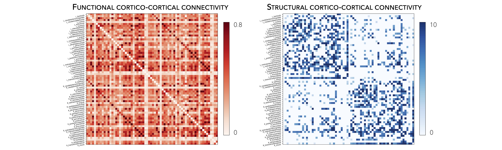
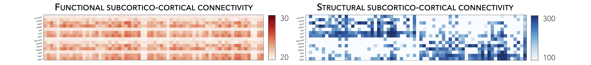
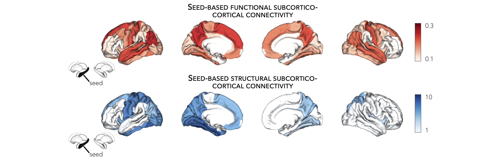

.. _hcp_connectivity:

.. title:: Load connectivity data

Connectivity data
==================================================

This page contains descriptions and examples to use Human Connectome Project (HCP) connectivity data.

Neuroimaging, particularly with functional and diffusion MRI, has become a leading tool to characterize 
human brain network organization *in vivo* and to identify network alterations in brain disorders. 
The **ENIGMA TOOLBOX** includes high-resolution structural (derived from diffusion-weighted tractography) 
and functional (derived from resting-state functional MRI) connectivity data from a cohort of unrelated 
healthy adults from the Human Connectome Project (HCP). Preprocessed cortico-cortical, subcortico-cortical, 
and subcortico-subcortical functional and structural connectivity matrices can be easily retrieved using the 
``load_fc()`` and ``load_sc()`` functions. 

High-resolution functional and structural data were parcellated according to the `Desikan-Killiany 
<https://www.sciencedirect.com/science/article/abs/pii/S1053811906000437?via%3Dihub>`_, 
`Glasser <https://www.nature.com/articles/nature18933>`_, as well as 
`Schaefer <https://academic.oup.com/cercor/article/28/9/3095/3978804>`_ 100, 200, 300, and 400 parcellations.

Normative functional connectivity matrices were generated by computing pairwise correlations between the time 
series of all cortical regions and subcortical (nucleus accumbens, amygdala, caudate, hippocampus, pallidum, 
putamen, thalamus) regions; negative connections were set to zero. Subject-specific connectivity matrices were 
then *z*-transformed and aggregated across participants to construct a group-average functional connectome. 
Available cortico-cortical, subcortico-cortical, and subcortico-subcortical matrices are unthresholded. 

Normative structural connectivity matrices were generated from preprocessed diffusion MRI data using `MRtrix3 <https://www.mrtrix.org/>`_. 
Anatomical constrained tractography was performed using different tissue types derived from the T1-weighted image, 
including cortical and subcortical gray matter, white matter, and cerebrospinal fluid. Multi-shell and multi-tissue 
response functions were estimated104 and constrained spherical deconvolution and intensity normalization were performed. 
The initial tractogram was generated with 40 million streamlines, with a maximum tract length of 250 and a fractional anisotropy cutoff of 0.06. 
Spherical-deconvolution informed filtering of tractograms (SIFT2) was applied to reconstruct whole-brain streamlines weighted 
by the cross-section multipliers. Reconstructed streamlines were mapped onto the 68 cortical and 14 subcortical 
(including hippocampus) regions to produce subject-specific structural connectivity matrices. 
The group-average normative structural connectome was defined using a distance-dependent thresholding 
procedure, which preserved the edge length distribution in individual patients, and was log 
transformed to reduce connectivity strength variance. As such, structural connectivity was defined by the 
number of streamlines between two regions (*i.e.*, fiber density).

Additional details on subject inclusion and data preprocessing are provided in the **ENIGMA TOOLBOX** `preprint 
<https://doi.org/10.1101/2020.12.21.423838>`_.

.. admonition:: One matrix 🎤

     Are you looking for subcortico-subcortical connectivity? Or do you want cortical and subcortical connectivity 
     in one matrix? If so, check out our functions: ``load_fc_as_one()`` 
     :ref:`here<load_fc_as_one_mat>` and ``load_sc_as_one()`` :ref:`here<load_sc_as_one_mat>`!

.. _load_corticocortical:

Load cortical connectivity matrices
----------------------------------------
The **ENIGMA TOOLBOX** provides structural (diffusion MRI) and functional 
(resting-state functional MRI) connectivity matrices obtained from the HCP. 

.. tabs::

   .. code-tab:: py
       
        >>> from enigmatoolbox.datasets import load_sc, load_fc
        >>> from nilearn import plotting

        >>> # Load cortico-cortical functional connectivity data
        >>> fc_ctx, fc_ctx_labels, _, _ = load_fc()
        
        >>> # Load cortico-cortical structural connectivity data
        >>> sc_ctx, sc_ctx_labels, _, _ = load_sc()

        >>> # Plot cortico-cortical connectivity matrices
        >>> fc_plot = plotting.plot_matrix(fc_ctx, figure=(9, 9), labels=fc_ctx_labels, vmax=0.8, vmin=0, cmap='Reds')
        >>> sc_plot = plotting.plot_matrix(sc_ctx, figure=(9, 9), labels=sc_ctx_labels, vmax=10, vmin=0, cmap='Blues')

   .. code-tab:: matlab

        % Load cortico-cortical functional connectivity data
        [fc_ctx, fc_ctx_labels, ~, ~] = load_fc();

        % Load cortico-cortical structural connectivity data
        [sc_ctx, sc_ctx_labels, ~, ~] = load_sc();

        % Plot cortico-cortical connectivity matrices
        f = figure,
          imagesc(fc_ctx, [0 0.8]); 
          axis square;              
          colormap(Reds);                          
          colorbar;                                
          set(gca, 'YTick', 1:1:length(fc_ctx_labels), ...   
              'YTickLabel', fc_ctx_labels)         

        f = figure,
          imagesc(sc_ctx, [0 10]); 
          axis square;                
          colormap(Blues);                        
          colorbar;                               
          set(gca, 'YTick', 1:1:length(sc_ctx_labels), ...   
              'YTickLabel', sc_ctx_labels)        

Following the example below, we can also extract seed-based cortico-cortical connectivity, using the 
left middle temporal gyrus as example seed. 

.. tabs::

   .. code-tab:: py
       
        >>> from enigmatoolbox.utils.parcellation import parcel_to_surface
        >>> from enigmatoolbox.plotting import plot_cortical

        >>> # Extract seed-based connectivity
        >>> seed = "L_middletemporal"
        >>> seed_conn_fc = fc_ctx[[i for i, item in enumerate(fc_ctx_labels) if seed in item], ]
        >>> seed_conn_sc = sc_ctx[[i for i, item in enumerate(sc_ctx_labels) if seed in item], ]

        >>> # Map parcellated data to the surface
        >>> seed_conn_fc_fsa5 = parcel_to_surface(seed_conn_fc, 'aparc_fsa5')
        >>> seed_conn_sc_fsa5 = parcel_to_surface(seed_conn_sc, 'aparc_fsa5')

        >>> # Project the results on the surface brain
        >>> plot_cortical(array_name=seed_conn_fc_fsa5, surface_name="fsa5", size=(800, 400),
        ...               cmap='Reds', color_bar=True, color_range=(0.2, 0.7))

        >>> plot_cortical(array_name=seed_conn_sc_fsa5, surface_name="fsa5", size=(800, 400),
        ...               cmap='Blues', color_bar=True, color_range=(2, 10))

   .. code-tab:: matlab

        % Extract seed-based connectivity
        seed = 'L_middletemporal'
        seed_conn_fc = fc_ctx(find(strcmp(fc_ctx_labels, seed)), :)
        seed_conn_sc = sc_ctx(find(strcmp(sc_ctx_labels, seed)), :)

        % Map parcellated data to the surface
        seed_conn_fc_fsa5 = parcel_to_surface(seed_conn_fc, 'aparc_fsa5');
        seed_conn_sc_fsa5 = parcel_to_surface(seed_conn_sc, 'aparc_fsa5');

        % Project the results on the surface brain
        f = figure,
            plot_cortical(seed_conn_fc_fsa5, 'cmap', 'Reds', 'color_range', [0.2 0.7])

        f = figure,
            plot_cortical(seed_conn_sc_fsa5, 'cmap', 'Blues', 'color_range', [2 10])  

.. image:: ./examples/example_figs/ctx_sbconn.png
    :align: center

|

.. _load_subcorticocortical:

Load subcortical connectivity matrices
-------------------------------------------
| Subcortico-cortical as well as subcortico-subcortical connectivity matrices are also included in the
 **ENIGMA TOOLBOX**. As above, we can load these structural and functional matrices and extract seed-based connectivity
 from subcortical seeds.

.. tabs::

   .. code-tab:: py

        >>> from enigmatoolbox.datasets import load_sc, load_fc
        >>> from nilearn import plotting

        >>> # Load subcortico-cortical functional connectivity data
        >>> _, _, fc_sctx, fc_sctx_labels = load_fc()

        >>> # Load subcortico-cortical structural connectivity data
        >>> _, _, sc_sctx, sc_sctx_labels = load_sc()

        >>> # Plot subcortico-cortical connectivity matrices
        >>> fc_plot = plotting.plot_matrix(fc_sctx, figure=(9, 9), labels=fc_sctx_labels, vmax=0.5, vmin=0, cmap='Reds')
        >>> sc_plot = plotting.plot_matrix(sc_sctx, figure=(9, 9), labels=sc_sctx_labels, vmax=10, vmin=0, cmap='Blues')

   .. code-tab:: matlab

        % Load subcortico-cortical functional connectivity data
        [~, ~, fc_sctx, fc_sctx_labels] = load_fc();

        % Load subcortico-cortical structural connectivity data
        [~, ~, sc_sctx, sc_sctx_labels] = load_sc();

        % Plot subcortico-cortical connectivity matrices 
        f = figure,
          imagesc(fc_sctx, [0 0.5]);  
          axis square;             
          colormap(Reds);                          
          colorbar;                                
          set(gca, 'YTick', 1:1:length(fc_sctx_labels), ...   
              'YTickLabel', fc_sctx_labels)       

        f = figure,
          imagesc(sc_sctx, [0 10]);    
          axis square;            
          colormap(Blues);                         
          colorbar;                                
          set(gca, 'YTick', 1:1:length(sc_sctx_labels), ...   
              'YTickLabel', sc_sctx_labels)       

As described above, we can also extract seed-based subcortico-cortical connectivity, using the left hippocampus 
as example seed. 

.. tabs::

   .. code-tab:: py

        >>> from enigmatoolbox.plotting import plot_cortical

        >>> # Extract seed-based connectivity
        >>> seed = "Lhippo"
        >>> seed_conn_fc = fc_sctx[[i for i, item in enumerate(fc_sctx_labels) if seed in item],]
        >>> seed_conn_sc = sc_sctx[[i for i, item in enumerate(sc_sctx_labels) if seed in item],]

        >>> # Map parcellated data to the surface
        >>> seed_conn_fc_fsa5 = parcel_to_surface(seed_conn_fc, 'aparc_fsa5')
        >>> seed_conn_sc_fsa5 = parcel_to_surface(seed_conn_sc, 'aparc_fsa5')

        >>> # Project the results on the surface brain
        >>> plot_cortical(array_name=seed_conn_fc_fsa5, surface_name="fsa5", size=(800, 400),
        ...               cmap='Reds', color_bar=True, color_range=(0.1, 0.3))

        >>> plot_cortical(array_name=seed_conn_sc_fsa5, surface_name="fsa5", size=(800, 400),
        ...               cmap='Blues', color_bar=True, color_range=(1, 10))

   .. code-tab:: matlab    

        % Extract seed-based connectivity
        seed = 'Lhippo'
        seed_conn_fc = fc_sctx(find(strcmp(fc_sctx_labels, seed)), :)
        seed_conn_sc = sc_sctx(find(strcmp(sc_sctx_labels, seed)), :)

        % Map parcellated data to the surface
        seed_conn_fc_fsa5 = parcel_to_surface(seed_conn_fc, 'aparc_fsa5');
        seed_conn_sc_fsa5 = parcel_to_surface(seed_conn_sc, 'aparc_fsa5');

        % Project the results on the surface brain
        f = figure,
            plot_cortical(seed_conn_fc_fsa5, 'cmap', 'Reds', 'color_range', [0.1 0.3])

        f = figure,
            plot_cortical(seed_conn_sc_fsa5, 'cmap', 'Blues', 'color_range', [1 10])

