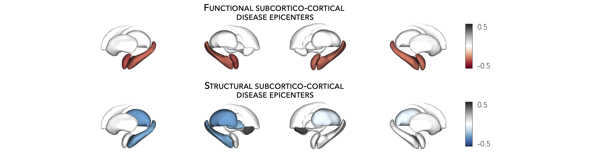
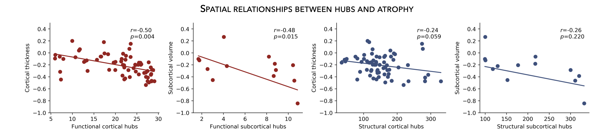

.. _hubs_susceptibility:

.. title:: Hub susceptibility model

Hub susceptibility
======================================

This page contains descriptions and examples to build hub susceptibility models. For additional details 
on hub susceptibility models, please see our manuscript entitled 
`Network-based atrophy modeling in the common epilepsies: a worldwide ENIGMA study <https://advances.sciencemag.org/content/6/47/eabc6457>`_.

.. _cortical_hubs:

Cortical hubs
------------------------------------------
Normative structural and functional connectomes hold valuable information for relating macroscopic brain network 
organization to patterns of disease-related atrophy. Using the :ref:`HCP connectivity data <hcp_connectivity>`, 
we can first compute weighted (optimal for unthresholded connectivity
matrices) degree centrality to identify structural and functional hub regions (*i.e.*, brain regions with many connections). 
This is done by simply computing the sum of all weighted cortico-cortical connections for every region. Higher degree centrality 
denotes increased hubness.

.. parsed-literal:: 

     **Prerequisites**
     ↪ :ref:`Load cortico-cortical connectivity matrices <load_corticocortical>`

.. tabs::

   .. code-tab:: py
       
        >>> import numpy as np
        >>> from enigmatoolbox.plotting import plot_cortical
        >>> from enigmatoolbox.utils.parcellation import parcel_to_surface

        >>> # Compute weighted degree centrality measures from the connectivity data
        >>> fc_ctx_dc = np.sum(fc_ctx, axis=0)
        >>> sc_ctx_dc = np.sum(sc_ctx, axis=0)

        >>> # Map parcellated data to the surface
        >>> fc_ctx_dc_fsa5 = parcel_to_surface(fc_ctx_dc, 'aparc_fsa5')
        >>> sc_ctx_dc_fsa5 = parcel_to_surface(sc_ctx_dc, 'aparc_fsa5')

        >>> # Project the results on the surface brain
        >>> plot_cortical(array_name=fc_ctx_dc_fsa5, surface_name="fsa5", size=(800, 400),
        ...               cmap='Reds', color_bar=True, color_range=(20, 30))

        >>> plot_cortical(array_name=sc_ctx_dc_fsa5, surface_name="fsa5", size=(800, 400),
        ...               cmap='Blues', color_bar=True, color_range=(100, 300))

   .. code-tab:: matlab

        % Compute weighted degree centrality measures from the connectivity data
        fc_ctx_dc           = sum(fc_ctx);
        sc_ctx_dc           = sum(sc_ctx);

        % Map parcellated data to the surface
        fc_ctx_dc_fsa5      = parcel_to_surface(fc_ctx_dc, 'aparc_fsa5');
        sc_ctx_dc_fsa5      = parcel_to_surface(sc_ctx_dc, 'aparc_fsa5');

        % Project the results on the surface brain
        f = figure,
          plot_cortical(fc_ctx_dc_fsa5, 'surface_name', 'fsa5', 'color_range', [20 30], ...
                        'cmap', 'Reds', 'label_text', 'Functional degree centrality')
     
        f = figure,
          plot_cortical(sc_ctx_dc_fsa5, 'surface_name', 'fsa5', 'color_range', [100 300], ...
                        'cmap', 'Blues', 'label_text', 'Structural degree centrality')

.. image:: ./examples/example_figs/hubs_ctx.png
    :align: center

|

.. _subcortical_hubs:

Subcortical hubs
---------------------------------------------
The :ref:`HCP connectivity data <load_subcorticocortical>` can also be used to identify structural 
and functional subcortico-cortical hub regions. As above, we simply compute the sum of all weighted 
subcortico-cortical connections for every subcortical area. Once again, higher degree centrality 
denotes increased hubness.

.. admonition:: No ventricles, no problem 👌🏼

     Because we do not have connectivity values for the ventricles, do make sure to set 
     the "ventricles" flag to ``False`` when displaying the findings on the subcortical surfaces.

.. parsed-literal:: 

     **Prerequisites**
     ↪ :ref:`Load subcortico-cortical connectivity matrices <load_subcorticocortical>`

.. tabs::

   .. code-tab:: py 

        >>> import numpy as np
        >>> from enigmatoolbox.plotting import plot_subcortical

        >>> # Compute weighted degree centrality measures from the connectivity data
        >>> fc_sctx_dc = np.sum(fc_sctx, axis=1)
        >>> sc_sctx_dc = np.sum(sc_sctx, axis=1)

        >>> # Project the results on the surface brain
        >>> plot_subcortical(array_name=fc_sctx_dc, ventricles=False, size=(800, 400),
        ...                  cmap='Reds', color_bar=True, color_range=(5, 10))

        >>> plot_subcortical(array_name=sc_sctx_dc, ventricles=False, size=(800, 400),
        ...                  cmap='Blues', color_bar=True, color_range=(100, 300))

   .. code-tab:: matlab 

        % Compute weighted degree centrality measures from the connectivity data
        fc_sctx_dc          = sum(fc_sctx, 2);
        sc_sctx_dc          = sum(sc_sctx, 2);

        % Project the results on the surface brain
        f = figure,
          plot_subcortical(fc_sctx_dc, 'ventricles', 'False', 'color_range', [5 10], ...
                           'cmap', 'Reds', 'label_text', 'Functional degree centrality')
     
        f = figure,
          plot_subcortical(sc_sctx_dc, 'ventricles', 'False', 'color_range', [100 300], ...
                           'cmap', 'Blues', 'label_text', 'Structural degree centrality') 

|

Hub-atrophy correlations
-------------------------------------------------------
Now that we have established the spatial distribution of hubs in the brain, we can then assess whether these hub 
regions are selectively vulnerable to syndrome-specific atrophy patterns.
For simplicity, in the following example, we will spatially correlate degree centrality measures to measures of 
cortical and subcortical atrophy (where lower values indicate greater atrophy relative to controls).

.. parsed-literal:: 

     **Prerequisites**
     ↪ Load :ref:`summary statistics <load_sumstats>` **or** :ref:`example data <load_example_data>`
     ↪ :ref:`Re-order subcortical data <reorder_sctx>` (*mega only*)
     ↪ :ref:`Z-score data <zscore_data>` (*mega only*)
     ↪ Load :ref:`cortico-cortical <load_corticocortical>` and :ref:`subcortico-cortical <load_subcorticocortical>` connectivity matrices
     ↪ Compute :ref:`cortical-cortical <cortical_hubs>` and :ref:`subcortico-cortical <subcortical_hubs>` degree centrality
     
.. tabs::

   .. code-tab:: py **Python** | meta
     
        >>> import numpy as np
        
        >>> # Remove subcortical values corresponding to the ventricles 
        >>> # (as we don't have connectivity values for them!)
        >>> SV_d_noVent = SV_d.drop([np.where(SV['Structure'] == 'LLatVent')[0][0],
        ...                         np.where(SV['Structure'] == 'RLatVent')[0][0]]).reset_index(drop=True)

        >>> # Perform spatial correlations between functional hubs and Cohen's d
        >>> fc_ctx_r = np.corrcoef(fc_ctx_dc, CT_d)[0, 1]
        >>> fc_sctx_r = np.corrcoef(fc_sctx_dc, SV_d_noVent)[0, 1]

        >>> # Perform spatial correlations between structural hubs and Cohen's d
        >>> sc_ctx_r = np.corrcoef(sc_ctx_dc, CT_d)[0, 1]
        >>> sc_sctx_r = np.corrcoef(sc_sctx_dc, SV_d_noVent)[0, 1]

        >>> # Store correlation coefficients
        >>> rvals = {'functional cortical hubs': fc_ctx_r, 'functional subcortical hubs': fc_sctx_r,
        ...          'structural cortical hubs': sc_ctx_r, 'structural subcortical hubs': sc_sctx_r}

   .. code-tab:: matlab **Matlab** | meta

        % Remove subcortical values corresponding the ventricles
        % (as we don't have connectivity values for them!)
        SV_d_noVent = SV_d;
        SV_d_noVent([find(strcmp(SV.Structure, 'LLatVent')); ...
                    find(strcmp(SV.Structure, 'RLatVent'))], :) = [];

        % Perform spatial correlations between cortical hubs and Cohen's d
        fc_ctx_r = corrcoef(fc_ctx_dc, CT_d);
        sc_ctx_r = corrcoef(sc_ctx_dc, CT_d);

        % Perform spatial correlations between structural hubs and Cohen's d
        fc_sctx_r = corrcoef(fc_sctx_dc, SV_d_noVent);
        sc_sctx_r = corrcoef(sc_sctx_dc, SV_d_noVent);

        % Store correlation coefficients
        rvals = cell2struct({fc_ctx_r(1, 2), fc_sctx_r(1, 2), sc_ctx_r(1, 2), sc_sctx_r(1, 2)}, ...
                            {'functional_cortical_hubs', 'functional_subcortical_hubs', ...
                             'structural_cortical_hubs', 'structural_subcortical_hubs'}, 2);

   .. tab:: ⤎ ⤏

          | ⤎ If you have **meta**-analysis data (*e.g.*, summary statistics)
          | ⤏ If you have individual site or **mega**-analysis data

   .. code-tab:: py **Python** | mega

        >>> import numpy as np

        >>> # Remove subcortical values corresponding to the ventricles
        >>> # (as we don't have connectivity values for them!)
        >>> SV_z_mean_noVent = SV_z_mean.drop(['LLatVent', 'RLatVent']).reset_index(drop=True)

        >>> # Perform spatial correlations between functional hubs and z-scores
        >>> fc_ctx_r = np.corrcoef(fc_ctx_dc, CT_z_mean)[0, 1]
        >>> fc_sctx_r = np.corrcoef(fc_sctx_dc, SV_z_mean_noVent)[0, 1]

        >>> # Perform spatial correlations between structural hubs and z-scores
        >>> sc_ctx_r = np.corrcoef(sc_ctx_dc, CT_z_mean)[0, 1]
        >>> sc_sctx_r = np.corrcoef(sc_sctx_dc, SV_z_mean_noVent)[0, 1]

        >>> # Store correlation coefficients
        >>> rvals = {'functional cortical hubs': fc_ctx_r, 'functional subcortical hubs': fc_sctx_r,
        ...          'structural cortical hubs': sc_ctx_r, 'structural subcortical hubs': sc_sctx_r}

   .. code-tab:: matlab **Matlab** | mega

        % Remove subcortical values corresponding the ventricles
        % (as we don't have connectivity values for them!)
        SV_z_mean_noVent = SV_z_mean;
        SV_z_mean_noVent.LLatVent = [];
        SV_z_mean_noVent.RLatVent = [];

        % Perform spatial correlations between cortical hubs and Cohen's d
        fc_ctx_r = corrcoef(fc_ctx_dc, CT_z_mean{:, :});
        sc_ctx_r = corrcoef(sc_ctx_dc, CT_z_mean{:, :});

        % Perform spatial correlations between structural hubs and Cohen's d
        fc_sctx_r = corrcoef(fc_sctx_dc, SV_z_mean_noVent{:, :});
        sc_sctx_r = corrcoef(sc_sctx_dc, SV_z_mean_noVent{:, :});

        % Store correlation coefficients
        rvals = cell2struct({fc_ctx_r(1, 2), fc_sctx_r(1, 2), sc_ctx_r(1, 2), sc_sctx_r(1, 2)}, ...
                            {'functional_cortical_hubs', 'functional_subcortical_hubs', ...
                             'structural_cortical_hubs', 'structural_subcortical_hubs'}, 2);

|

Plot hub-atrophy correlations
------------------------------------------------------------------------
Now that we have done all the necessary analyses, we can finally display our correlations. 
Here, a negative correlation indicates that greater atrophy correlates 
with the spatial distribution of hub regions (greater degree centrality).  

.. parsed-literal:: 

     **Prerequisites**
          The script below can be used to show relationships between any two variables, as for example: 
          degree centrality *vs*. atrophy
               ↪ Load :ref:`summary statistics <load_sumstats>` **or** :ref:`example data <load_example_data>`
               ↪ :ref:`Re-order subcortical data <reorder_sctx>` (*mega only*)
               ↪ :ref:`Z-score data <zscore_data>` (*mega only*)
               ↪ Load :ref:`cortico-cortical <load_corticocortical>` and :ref:`subcortico-cortical <load_subcorticocortical>` connectivity matrices
               ↪ Compute :ref:`cortical-cortical <cortical_hubs>` and :ref:`subcortico-cortical <subcortical_hubs>` degree centrality     
               ↪ Assess statistical significance via :ref:`spin permutation tests <spin_perm>`

.. tabs::

   .. code-tab:: py **Python** | meta
     
        >>> import matplotlib.pyplot as plt
        >>> import numpy as np
        
        >>> # Store degree centrality and atrophy measures
        >>> meas = {('functional cortical hubs', 'cortical thickness'): [fc_ctx_dc, CT_d],
        ...         ('functional subcortical hubs', 'subcortical volume'): [fc_sctx_dc, SV_d_noVent],
        ...         ('structural cortical hubs', 'cortical thickness'): [sc_ctx_dc, CT_d],
        ...         ('structural subcortical hubs', 'subcortical volume'): [sc_sctx_dc, SV_d_noVent]}

        >>> fig, axs = plt.subplots(1, 4, figsize=(15, 3))

        >>> for k, (fn, dd) in enumerate(meas.items()):
        >>>     # Define scatter colors
        >>>     if k <= 1:
        >>>         col = '#A8221C'
        >>>     else:
        >>>         col = '#324F7D'

        >>>     # Plot relationships between hubs and atrophy
        >>>     axs[k].scatter(meas[fn][0], meas[fn][1], color=col,
        ...                    label='$r$={:.2f}'.format(rvals[fn[0]]) + '\n$p$={:.3f}'.format(p_and_d[fn[0]][0]))
        >>>     m, b = np.polyfit(meas[fn][0], meas[fn][1], 1)
        >>>     axs[k].plot(meas[fn][0], m * meas[fn][0] + b, color=col)
        >>>     axs[k].set_ylim((-1, 0.5))
        >>>     axs[k].set_xlabel('{}'.format(fn[0].capitalize()))
        >>>     axs[k].set_ylabel('{}'.format(fn[1].capitalize()))
        >>>     axs[k].spines['top'].set_visible(False)
        >>>     axs[k].spines['right'].set_visible(False)
        >>>     axs[k].legend(loc=1, frameon=False, markerscale=0)

        >>> fig.tight_layout()
        >>> plt.show()

   .. code-tab:: matlab **Matlab** | meta

        % Store degree centrality measures
        meas  =  cell2struct({fc_ctx_dc.', fc_sctx_dc, sc_ctx_dc.', sc_sctx_dc}, ...
                             {'Functional_cortical_hubs', 'Functional_subcortical_hubs', ...
                             'Structural_cortical_hubs', 'Structural_subcortical_hubs'}, 2);
        fns   = fieldnames(meas);

        % Store atrophy measures
        meas2 =  cell2struct({CT_d, SV_d_noVent}, {'Cortical_thickness', 'Subcortical_volume'}, 2);
        fns2  = fieldnames(meas2);

        f = figure,
            set(gcf,'color','w');
            set(gcf,'units','normalized','position',[0 0 1 0.3])
            k2 = [1 2 1 2];
    
            for k = 1:numel(fieldnames(meas))
                j = k2(k);
        
                % Define plot colors
                if k <= 2; col = [0.66 0.13 0.11]; else; col = [0.2 0.33 0.49]; end
        
                % Plot relationships between hubs and atrophy
                axs = subplot(1, 4, k); hold on
                s   = scatter(meas.(fns{k}), meas2.(fns2{j}), 88, col, 'filled'); 
                P1      = polyfit(meas.(fns{k}), meas2.(fns2{j}), 1);                               
                yfit_1  = P1(1) * meas.(fns{k}) + P1(2);
                plot(meas.(fns{k}), yfit_1, 'color',col, 'LineWidth', 3) 
                ylim([-1 0.5])
                xlabel(strrep(fns{k}, '_', ' '))
                ylabel(strrep(fns2{j}, '_', ' '))
                legend(s, ['{\it r}=' num2str(round(rvals.(lower(fns{k})), 2)) newline ...
                          '{\it p}=' num2str(round(p_and_d.(lower(fns{k}))(1), 3))])
                legend boxoff
            end

   .. tab:: ⤎ ⤏

          | ⤎ If you have **meta**-analysis data (*e.g.*, summary statistics)
          | ⤏ If you have individual site or **mega**-analysis data

   .. code-tab:: py **Python** | mega

        >>> import matplotlib.pyplot as plt
        >>> import numpy as np

        >>> # Store degree centrality and atrophy measures
        >>> meas = {('functional cortical hubs', 'cortical thickness'): [fc_ctx_dc, CT_z_mean],
        ...         ('functional subcortical hubs', 'subcortical volume'): [fc_sctx_dc, SV_z_mean_noVent],
        ...         ('structural cortical hubs', 'cortical thickness'): [sc_ctx_dc, CT_z_mean],
        ...         ('structural subcortical hubs', 'subcortical volume'): [sc_sctx_dc, SV_z_mean_noVent]}

        >>> fig, axs = plt.subplots(1, 4, figsize=(15, 3))

        >>> for k, (fn, dd) in enumerate(meas.items()):
        >>>     # Define scatter colors
        >>>     if k <= 1:
        >>>         col = '#A8221C'
        >>>     else:
        >>>         col = '#324F7D'

        >>>     # Plot relationships between hubs and atrophy
        >>>     axs[k].scatter(meas[fn][0], meas[fn][1], color=col,
        ...                    label='$r$={:.2f}'.format(rvals[fn[0]]) + '\n$p$={:.3f}'.format(p_and_d[fn[0]][0]))
        >>>     m, b = np.polyfit(meas[fn][0], meas[fn][1], 1)
        >>>     axs[k].plot(meas[fn][0], m * meas[fn][0] + b, color=col)
        >>>     axs[k].set_ylim((-3.5, 1.5))
        >>>     axs[k].set_xlabel('{}'.format(fn[0].capitalize()))
        >>>     axs[k].set_ylabel('{}'.format(fn[1].capitalize()))
        >>>     axs[k].spines['top'].set_visible(False)
        >>>     axs[k].spines['right'].set_visible(False)
        >>>     axs[k].legend(loc=1, frameon=False, markerscale=0)

        >>> fig.tight_layout()
        >>> plt.show()

   .. code-tab:: matlab **Matlab** | mega

        % Store degree centrality measures
        meas  =  cell2struct({fc_ctx_dc, fc_sctx_dc.', sc_ctx_dc, sc_sctx_dc.'}, ...
                             {'Functional_cortical_hubs', 'Functional_subcortical_hubs', ...
                     'Structural_cortical_hubs', 'Structural_subcortical_hubs'}, 2);
        fns   = fieldnames(meas);

        % Store atrophy measures
        meas2 =  cell2struct({CT_z_mean{:, :}, SV_z_mean_noVent{:, :}}, ...
                             {'Cortical_thickness', 'Subcortical_volume'}, 2);
        fns2  = fieldnames(meas2);

        f = figure,
            set(gcf,'color','w');
            set(gcf,'units','normalized','position',[0 0 1 0.3])
            k2 = [1 2 1 2];

            for k = 1:numel(fieldnames(meas))
                j = k2(k);

                % Define plot colors
                if k <= 2; col = [0.66 0.13 0.11]; else; col = [0.2 0.33 0.49]; end

                % Plot relationships between hubs and atrophy
                axs = subplot(1, 4, k); hold on
                s   = scatter(meas.(fns{k}), meas2.(fns2{j}), 88, col, 'filled');
                P1      = polyfit(meas.(fns{k}), meas2.(fns2{j}), 1);
                yfit_1  = P1(1) * meas.(fns{k}) + P1(2);
                plot(meas.(fns{k}), yfit_1, 'color',col, 'LineWidth', 3)
                ylim([-3 1.5])
                xlabel(strrep(fns{k}, '_', ' '))
                ylabel(strrep(fns2{j}, '_', ' '))
                legend(s, ['{\it r}=' num2str(round(rvals.(lower(fns{k})), 2)) newline ...
                          '{\it p}=' num2str(round(p_and_d.(lower(fns{k}))(1), 3))])
                legend boxoff
            end
    

