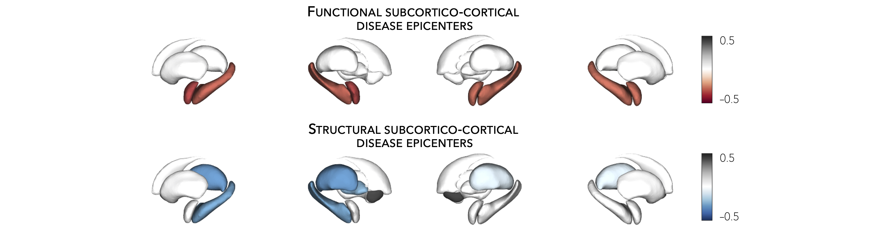

.. _epi_mapping:

.. title:: Epicenter mapping

Epicenter mapping
======================================

This page contains descriptions and examples to identify disease epicenters. For additional details 
on disease epicenter mapping, please see our manuscript entitled 
`Network-based atrophy modeling in the common epilepsies: a worldwide ENIGMA study <https://advances.sciencemag.org/content/6/47/eabc6457>`_.

Cortical epicenters
---------------------
Using the :ref:`HCP connectivity data <hcp_connectivity>`, we can also identify epicenters of cortical atrophy. 
Disease epicenters are regions whose functional and/or structural connectivity profile spatially resembles a given 
disease-related atrophy map. Hence, disease epicenters can be identified by spatially correlating every region’s 
healthy functional and/or structural connectivity profiles (*i.e.*, cortico-cortical connectivity) to whole-brain 
atrophy patterns in a given disease. This approach must be repeated systematically across the whole brain, 
assessing the statistical significance of the spatial similarity of every region’s functional and/or structural 
connectivity profiles to disease-specific abnormality maps with :ref:`spatial permutation tests <spin_perm>`. 
Cortical and subcortical (see :ref:`tutorial <sctx_epi>` below) epicenter regions can then be identified if 
their connectivity profiles are significantly correlated with the disease-specific abnormality map. 
Regardless of its atrophy level, a cortical (or subcortical) region could potentially be an epicenter if it is 
(*i*) strongly connected to other high-atrophy regions and (*ii*) weakly connected to low-atrophy regions.

In this tutorial, our *atrophy map* was derived from cortical thickness decreases in individuals with left TLE.

.. admonition:: Epicenters? 🤔

     Cortical and subcortical epicenter regions are identified if their connectivity profiles correlate with a disease-specific *cortical* atrophy map. 
     In the following examples, regions with strong *negative* correlations represent disease epicenters. Moreover, and regardless of its atrophy level, 
     a cortical or subcortical region can be an epicenter if it is (*i*) strongly connected to other high-atrophy cortical regions and (*ii*) weakly connected 
     to low-atrophy cortical regions. 

.. parsed-literal:: 

    **Prerequisites**
    ↪ Load :ref:`summary statistics <load_sumstats>` **or** :ref:`example data <load_example_data>`
    ↪ :ref:`Z-score data <zscore_data>` (*mega only*)
    ↪ Load :ref:`cortico-cortical connectivity matrices <load_corticocortical>` 

.. _ctx_epi:

.. tabs::

   .. code-tab:: py **Python** | meta
     
        >>> import numpy as np
        >>> from enigmatoolbox.permutation_testing import spin_test

        >>> # Identify cortical epicenters (from functional connectivity)
        >>> fc_ctx_epi = []
        >>> fc_ctx_epi_p = []
        >>> for seed in range(fc_ctx.shape[0]):
        >>>     seed_con = fc_ctx[:, seed]
        >>>     fc_ctx_epi = np.append(fc_ctx_epi, np.corrcoef(seed_con, CT_d)[0, 1])
        >>>     fc_ctx_epi_p = np.append(fc_ctx_epi_p,
        ...                              spin_test(seed_con, CT_d, surface_name='fsa5', parcellation_name='aparc',
        ...                                        type='pearson', n_rot=1000, null_dist=False))

        >>> # Identify cortical epicenters (from structural connectivity)
        >>> sc_ctx_epi = []
        >>> sc_ctx_epi_p = []
        >>> for seed in range(sc_ctx.shape[0]):
        >>>     seed_con = sc_ctx[:, seed]
        >>>     sc_ctx_epi = np.append(sc_ctx_epi, np.corrcoef(seed_con, CT_d)[0, 1])
        >>>     sc_ctx_epi_p = np.append(sc_ctx_epi_p,
        ...                              spin_test(seed_con, CT_d, surface_name='fsa5', parcellation_name='aparc',
        ...                                        type='pearson', n_rot=1000, null_dist=False))

   .. code-tab:: matlab **Matlab** | meta

        % Identify cortical epicenter values (from functional connectivity)
        fc_ctx_epi              = zeros(size(fc_ctx, 1), 1);
        fc_ctx_epi_p            = zeros(size(fc_ctx, 1), 1);
        for seed = 1:size(fc_ctx, 1)
            seed_conn           = fc_ctx(:, seed);
            r_tmp               = corrcoef(seed_conn, CT_d);
            fc_ctx_epi(seed)    = r_tmp(1, 2);
            fc_ctx_epi_p(seed)  = spin_test(seed_conn, CT_d, 'surface_name', 'fsa5', 'parcellation_name', ...
                                            'aparc', 'n_rot', 1000, 'type', 'pearson');
        end

        % Identify cortical epicenter values (from structural connectivity)
        sc_ctx_epi              = zeros(size(sc_ctx, 1), 1);
        sc_ctx_epi_p            = zeros(size(sc_ctx, 1), 1);
        for seed = 1:size(sc_ctx, 1)
            seed_conn           = sc_ctx(:, seed);
            r_tmp               = corrcoef(seed_conn, CT_d);
            sc_ctx_epi(seed)    = r_tmp(1, 2);
            sc_ctx_epi_p(seed)  = spin_test(seed_conn, CT_d, 'surface_name', 'fsa5', 'parcellation_name', ...
                                            'aparc', 'n_rot', 1000, 'type', 'pearson');
        end

   .. tab:: ⤎ ⤏

          | ⤎ If you have **meta**-analysis data (*e.g.*, summary statistics)
          | ⤏ If you have individual site or **mega**-analysis data

   .. code-tab:: py **Python** | mega
       
        >>> import numpy as np
        >>> from enigmatoolbox.permutation_testing import spin_test

        >>> # Identify cortical epicenters (from functional connectivity)
        >>> fc_ctx_epi = []
        >>> fc_ctx_epi_p = []
        >>> for seed in range(fc_ctx.shape[0]):
        >>>     seed_con = fc_ctx[:, seed]
        >>>     fc_ctx_epi = np.append(fc_ctx_epi, np.corrcoef(seed_con, CT_z_mean)[0, 1])
        >>>     fc_ctx_epi_p = np.append(fc_ctx_epi_p,
        ...                              spin_test(seed_con, CT_z_mean, surface_name='fsa5', parcellation_name='aparc',
        ...                                        type='pearson', n_rot=1000, null_dist=False))

        >>> # Identify cortical epicenters (from structural connectivity)
        >>> sc_ctx_epi = []
        >>> sc_ctx_epi_p = []
        >>> for seed in range(sc_ctx.shape[0]):
        >>>     seed_con = sc_ctx[:, seed]
        >>>     sc_ctx_epi = np.append(sc_ctx_epi, np.corrcoef(seed_con, CT_z_mean)[0, 1])
        >>>     sc_ctx_epi_p = np.append(sc_ctx_epi_p,
        ...                              spin_test(seed_con, CT_z_mean, surface_name='fsa5', parcellation_name='aparc',
        ...                                        type='pearson', n_rot=1000, null_dist=False))

   .. code-tab:: matlab **Matlab** | mega

        % Identify cortical epicenter values (from functional connectivity)
        fc_ctx_epi              = zeros(size(fc_ctx, 1), 1);
        fc_ctx_epi_p            = zeros(size(fc_ctx, 1), 1);
        for seed = 1:size(fc_ctx, 1)
            seed_conn           = fc_ctx(:, seed);
            r_tmp               = corrcoef(seed_conn, CT_z_mean{:, :});
            fc_ctx_epi(seed)    = r_tmp(1, 2);
            fc_ctx_epi_p(seed)  = spin_test(seed_conn, CT_z_mean{:, :}, 'surface_name', 'fsa5', ...
                                            'parcellation_name', 'aparc', 'n_rot', 1000, 'type', 'pearson');
        end

        % Identify cortical epicenter values (from structural connectivity)
        sc_ctx_epi              = zeros(size(sc_ctx, 1), 1);
        sc_ctx_epi_p            = zeros(size(sc_ctx, 1), 1);
        for seed = 1:size(sc_ctx, 1)
            seed_conn           = sc_ctx(:, seed);
            r_tmp               = corrcoef(seed_conn, CT_z_mean{:, :});
            sc_ctx_epi(seed)    = r_tmp(1, 2);
            sc_ctx_epi_p(seed)  = spin_test(seed_conn, CT_z_mean{:, :}, 'surface_name', 'fsa5', ...
                                            'parcellation_name', 'aparc', 'n_rot', 1000, 'type', 'pearson');
        end

As we have assessed the significance of every spatial correlation between seed-based cortico-cortical connectivity and cortical atrophy measures
using spin permutation tests, we can set a significance threshold to identify disease epicenters. In the following example,
we set a lenient threshold of *p* < 0.1 (*i.e.*, correlation coefficients were set to zeros for regions whose *p*-values 
were greater than 0.1). We are, thus, displaying only correlation coefficients whose significances passes at least these lenient thresholds.

.. tabs::

   .. code-tab:: py
     
        >>> import numpy as np
        >>> from enigmatoolbox.utils.parcellation import parcel_to_surface
        >>> from enigmatoolbox.plotting import plot_cortical

        >>> # Project the results on the surface brain
        >>> # Selecting only regions with p < 0.1 (functional epicenters)
        >>> fc_ctx_epi_p_sig = np.zeros_like(fc_ctx_epi_p)
        >>> fc_ctx_epi_p_sig[np.argwhere(fc_ctx_epi_p < 0.1)] = fc_ctx_epi[np.argwhere(fc_ctx_epi_p < 0.1)]
        >>> plot_cortical(array_name=parcel_to_surface(fc_ctx_epi_p_sig, 'aparc_fsa5'), surface_name="fsa5", size=(800, 400),
        ...               cmap='GyRd_r', color_bar=True, color_range=(-0.5, 0.5))

        >>> # Selecting only regions with p < 0.1 (structural epicenters)
        >>> sc_ctx_epi_p_sig = np.zeros_like(sc_ctx_epi_p)
        >>> sc_ctx_epi_p_sig[np.argwhere(sc_ctx_epi_p < 0.1)] = sc_ctx_epi[np.argwhere(sc_ctx_epi_p < 0.1)]
        >>> plot_cortical(array_name=parcel_to_surface(sc_ctx_epi_p_sig, 'aparc_fsa5'), surface_name="fsa5", size=(800, 400),
        ...               cmap='GyBu_r', color_bar=True, color_range=(-0.5, 0.5))

   .. code-tab:: matlab

        % Project the results on the surface brain
        % Selecting only regions with p < 0.1 (functional epicenters)
        fc_ctx_epi_p_sig = zeros(length(fc_ctx_epi_p), 1);
        fc_ctx_epi_p_sig(find(fc_ctx_epi_p < 0.1)) = fc_ctx_epi(fc_ctx_epi_p<0.1);
        f = figure,
            plot_cortical(parcel_to_surface(fc_ctx_epi_p_sig, 'aparc_fsa5'), ...
                        'color_range', [-0.5 0.5], 'cmap', 'GyRd_r')
              
        % Selecting only regions with p < 0.1 (structural epicenters)
        sc_ctx_epi_p_sig = zeros(length(sc_ctx_epi_p), 1);
        sc_ctx_epi_p_sig(find(sc_ctx_epi_p < 0.1)) = sc_ctx_epi(sc_ctx_epi_p<0.1);
        f = figure,
            plot_cortical(parcel_to_surface(sc_ctx_epi_p_sig, 'aparc_fsa5'), ...
                        'color_range', [-0.5 0.5], 'cmap', 'GyBu_r')

.. image:: ./examples/example_figs/epi_ctx.png
    :align: center

|

Subcortical epicenters
-------------------------
Similar to the :ref:`cortical epicenter approach <ctx_epi>`, we can identify subcortical epicenters of cortical atrophy by 
correlating every subcortical region's seed-based connectivity profile (*e.g.*, subcortico-cortical connectivity) with 
a whole-brain cortical atrophy map. As above, our *atrophy map* was derived from cortical thickness decreases in individuals with left TLE.

.. parsed-literal:: 

    **Prerequisites**
    ↪ Load :ref:`summary statistics <load_sumstats>` **or** :ref:`example data <load_example_data>`
    ↪ :ref:`Z-score data <zscore_data>` (*mega only*)
    ↪ Load :ref:`subcortico-cortical connectivity matrices <load_subcorticocortical>` 

.. _sctx_epi:

.. tabs::

   .. code-tab:: py **Python** | meta
     
        >>> import numpy as np
        >>> from enigmatoolbox.permutation_testing import spin_test

        >>> # Identify subcortical epicenters (from functional connectivity)
        >>> fc_sctx_epi = []
        >>> fc_sctx_epi_p = []
        >>> for seed in range(fc_sctx.shape[0]):
        >>>     seed_con = fc_sctx[seed, :]
        >>>     fc_sctx_epi = np.append(fc_sctx_epi, np.corrcoef(seed_con, CT_d)[0, 1])
        >>>     fc_sctx_epi_p = np.append(fc_sctx_epi_p,
        ...                               spin_test(seed_con, CT_d, surface_name='fsa5', n_rot=1000))

        >>> # Identify subcortical epicenters (from structural connectivity)
        >>> sc_sctx_epi = []
        >>> sc_sctx_epi_p = []
        >>> for seed in range(sc_sctx.shape[0]):
        >>>     seed_con = sc_sctx[seed, :]
        >>>     sc_sctx_epi = np.append(sc_sctx_epi, np.corrcoef(seed_con, CT_d)[0, 1])
        >>>     sc_sctx_epi_p = np.append(sc_sctx_epi_p,
        ...                               spin_test(seed_con, CT_d, surface_name='fsa5', n_rot=1000))

   .. code-tab:: matlab **Matlab** | meta

        % Identify subcortical epicenter values (from functional connectivity)
        fc_sctx_epi             = zeros(size(fc_sctx, 1), 1);
        fc_sctx_epi_p           = zeros(size(fc_sctx, 1), 1);
        for seed = 1:size(fc_sctx, 1)
            seed_conn           = fc_sctx(seed, :);
            r_tmp               = corrcoef(seed_conn, CT_d);
            fc_sctx_epi(seed)   = r_tmp(1, 2);
            fc_sctx_epi_p(seed) = spin_test(seed_conn, CT_d, 'surface_name', 'fsa5', 'parcellation_name', ...
                                            'aparc', 'n_rot', 1000, 'type', 'pearson');
        end

        % Identify subcortical epicenter values (from structural connectivity)
        sc_sctx_epi             = zeros(size(sc_sctx, 1), 1);
        sc_sctx_epi_p           = zeros(size(sc_sctx, 1), 1);
        for seed = 1:size(sc_sctx, 1)
            seed_conn           = sc_sctx(seed, :);
            r_tmp               = corrcoef(seed_conn, CT_d);
            sc_sctx_epi(seed)   = r_tmp(1, 2);
            sc_sctx_epi_p(seed) = spin_test(seed_conn, CT_d, 'surface_name', 'fsa5', 'parcellation_name', ...
                                            'aparc', 'n_rot', 1000, 'type', 'pearson');
        end

   .. tab:: ⤎ ⤏

          | ⤎ If you have **meta**-analysis data (*e.g.*, summary statistics)
          | ⤏ If you have individual site or **mega**-analysis data

   .. code-tab:: py **Python** | mega

        >>> import numpy as np
        >>> from enigmatoolbox.permutation_testing import spin_test

        >>> # Identify subcortical epicenters (from functional connectivity)
        >>> fc_sctx_epi = []
        >>> fc_sctx_epi_p = []
        >>> for seed in range(fc_sctx.shape[0]):
        >>>     seed_con = fc_sctx[seed, :]
        >>>     fc_sctx_epi = np.append(fc_sctx_epi, np.corrcoef(seed_con, CT_z_mean)[0, 1])
        >>>     fc_sctx_epi_p = np.append(fc_sctx_epi_p,
        ...                               spin_test(seed_con, CT_z_mean, surface_name='fsa5', n_rot=1000))

        >>> # Identify subcortical epicenters (from structural connectivity)
        >>> sc_sctx_epi = []
        >>> sc_sctx_epi_p = []
        >>> for seed in range(sc_sctx.shape[0]):
        >>>     seed_con = sc_sctx[seed, :]
        >>>     sc_sctx_epi = np.append(sc_sctx_epi, np.corrcoef(seed_con, CT_z_mean)[0, 1])
        >>>     sc_sctx_epi_p = np.append(sc_sctx_epi_p,
        ...                               spin_test(seed_con, CT_z_mean, surface_name='fsa5', n_rot=1000))

   .. code-tab:: matlab **Matlab** | mega

        % Identify subcortical epicenter values (from functional connectivity)
        fc_sctx_epi             = zeros(size(fc_sctx, 1), 1);
        fc_sctx_epi_p           = zeros(size(fc_sctx, 1), 1);
        for seed = 1:size(fc_sctx, 1)
            seed_conn           = fc_sctx(seed, :);
            r_tmp               = corrcoef(seed_conn, CT_z_mean{:, :});
            fc_sctx_epi(seed)   = r_tmp(1, 2);
            fc_sctx_epi_p(seed) = spin_test(seed_conn, CT_z_mean{:, :}, 'surface_name', 'fsa5', ...
                                            'parcellation_name', 'aparc', 'n_rot', 1000, 'type', 'pearson');
        end

        % Identify subcortical epicenter values (from structural connectivity)
        sc_sctx_epi             = zeros(size(sc_sctx, 1), 1);
        sc_sctx_epi_p           = zeros(size(sc_sctx, 1), 1);
        for seed = 1:size(sc_sctx, 1)
            seed_conn           = sc_sctx(seed, :);
            r_tmp               = corrcoef(seed_conn, CT_z_mean{:, :});
            sc_sctx_epi(seed)   = r_tmp(1, 2);
            sc_sctx_epi_p(seed) = spin_test(seed_conn, CT_z_mean{:, :}, 'surface_name', 'fsa5', ...
                                            'parcellation_name', 'aparc', 'n_rot', 1000, 'type', 'pearson');
        end

As in the :ref:`cortical epicenters <ctx_epi>` example above, we have assessed the significance of every spatial correlation between 
seed-based subcortico-cortical connectivity and cortical atrophy measures
using spin permutation tests, and set a lenient threshold of *p* < 0.1 (*i.e.*, correlation coefficients were set to zeros for regions whose *p*-values 
were greater than 0.1). We are, thus, displaying only correlation coefficients whose significances passes at least these lenient thresholds.

.. tabs::

   .. code-tab:: py 
     
        >>> import numpy as np
        >>> from enigmatoolbox.plotting import plot_subcortical

        >>> # Project the results on the surface brain
        >>> # Selecting only regions with p < 0.1 (functional epicenters)
        >>> fc_sctx_epi_p_sig = np.zeros_like(fc_sctx_epi_p)
        >>> fc_sctx_epi_p_sig[np.argwhere(fc_sctx_epi_p < 0.1)] = fc_sctx_epi[np.argwhere(fc_sctx_epi_p < 0.1)]
        >>> plot_subcortical(fc_sctx_epi_p_sig, ventricles=False, size=(800, 400),
        ...                  cmap='GyRd_r', color_bar=True, color_range=(-0.5, 0.5))

        >>> # Selecting only regions with p < 0.1 (functional epicenters)
        >>> sc_sctx_epi_p_sig = np.zeros_like(sc_sctx_epi_p)
        >>> sc_sctx_epi_p_sig[np.argwhere(sc_sctx_epi_p < 0.1)] = sc_sctx_epi[np.argwhere(sc_sctx_epi_p < 0.1)]
        >>> plot_subcortical(sc_sctx_epi_p_sig, ventricles=False, size=(800, 400),
        ...                  cmap='GyBu_r', color_bar=True, color_range=(-0.5, 0.5))

   .. code-tab:: matlab 

        % Project the results on the surface brain
        % Selecting only regions with p < 0.1 (functional epicenters)
        fc_sctx_epi_p_sig = zeros(length(fc_sctx_epi_p), 1);
        fc_sctx_epi_p_sig(find(fc_sctx_epi_p < 0.1)) = fc_sctx_epi(fc_sctx_epi_p<0.1);
        f = figure,
            plot_subcortical(fc_sctx_epi_p_sig, 'ventricles', 'False', ...
                            'color_range', [-0.5 0.5], 'cmap', 'GyRd_r')
                        
        % Selecting only regions with p < 0.1 (structural epicenters)
        sc_sctx_epi_p_sig = zeros(length(sc_sctx_epi_p), 1);
        sc_sctx_epi_p_sig(find(sc_sctx_epi_p < 0.1)) = sc_sctx_epi(sc_sctx_epi_p<0.1);
        f = figure,
            plot_subcortical(sc_sctx_epi_p_sig, 'ventricles', 'False', ...
                            'color_range', [-0.5 0.5], 'cmap', 'GyBu_r')

