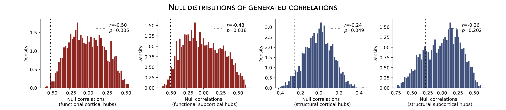

.. _spin_perm:

.. title:: Spin permutation tests

Spin permutation tests
======================================

This page contains descriptions and examples to assess statistical significance of two spatial maps.

Assess statistical significance
-------------------------------------------------------
The intrinsic spatial smoothness in two given **cortical maps** may inflate the significance of their spatial correlation. 
To overcome this challenge, we assess statistical significance using *spin permutation tests*, 
a framework proposed by `Alexander-Bloch and colleagues <https://www.sciencedirect.com/science/article/abs/pii/S1053811918304968?via%3Dihub>`_.
To do so, we generate null models of overlap between cortical maps by projecting the spatial 
coordinates of cortical data onto the surface spheres, apply randomly sampled rotations, 
and reassign cortical values. We then compare the original correlation coefficients against 
the empirical distribution determined by the ensemble of spatially permuted correlation coefficients. 

| 
     To compare spatial overlap between **subcortical maps**, we employed a similar approach with the exception 
     that subcortical labels were randomly shuffled as opposed to being projected onto spheres.    

.. parsed-literal:: 

     **Prerequisites**
     Two brain maps from which you want to assess the signifcance of their correlations, as for example: 
     degree centrality *vs*. atrophy
          ↪ Load :ref:`summary statistics <load_sumstats>` **or** :ref:`example data <load_example_data>`
          ↪ :ref:`Re-order subcortical data <reorder_sctx>` (*mega only*)
          ↪ :ref:`Z-score data <zscore_data>` (*mega only*)
          ↪ Load :ref:`cortico-cortical <load_corticocortical>` and :ref:`subcortico-cortical <load_subcorticocortical>` connectivity matrices
          ↪ Compute :ref:`cortical-cortical <cortical_hubs>` and :ref:`subcortico-cortical <subcortical_hubs>` degree centrality     

.. tabs::

   .. code-tab:: py **Python** | meta
     
        >>> from enigmatoolbox.permutation_testing import spin_test, shuf_test

        >>> # Remove subcortical values corresponding to the ventricles
        >>> # (as we don't have connectivity values for them!)
        >>> SV_d_noVent = SV_d.drop([np.where(SV['Structure'] == 'LLatVent')[0][0],
        ...                         np.where(SV['Structure'] == 'RLatVent')[0][0]]).reset_index(drop=True)

        >>> # Spin permutation testing for two cortical maps
        >>> fc_ctx_p, fc_ctx_d = spin_test(fc_ctx_dc, CT_d, surface_name='fsa5', parcellation_name='aparc',
        ...                                type='pearson', n_rot=1000, null_dist=True)
        >>> sc_ctx_p, sc_ctx_d = spin_test(sc_ctx_dc, CT_d, surface_name='fsa5', parcellation_name='aparc',
        ...                                type='pearson', n_rot=1000, null_dist=True)

        >>> # Shuf permutation testing for two subcortical maps
        >>> fc_sctx_p, fc_sctx_d = shuf_test(fc_sctx_dc, SV_d_noVent, n_rot=1000,
        ...                                  type='pearson', null_dist=True)
        >>> sc_sctx_p, sc_sctx_d = shuf_test(sc_sctx_dc, SV_d_noVent, n_rot=1000,
        ...                                  type='pearson', null_dist=True)

        >>> # Store p-values and null distributions
        >>> p_and_d = {'functional cortical hubs': [fc_ctx_p, fc_ctx_d], 'functional subcortical hubs': [fc_sctx_p, fc_sctx_d],
        ...            'structural cortical hubs': [sc_ctx_p, sc_ctx_d], 'structural subcortical hubs': [sc_sctx_p, sc_sctx_d]}

   .. code-tab:: matlab **Matlab** | meta

        % Remove subcortical values corresponding to the ventricles
        % (as we don't have connectivity values for them!)
        SV_d_noVent = SV_d;
        SV_d_noVent([find(strcmp(SV.Structure, 'LLatVent')); ...
                    find(strcmp(SV.Structure, 'RLatVent'))], :) = [];
        
        % Spin permutation testing for two cortical maps
        [fc_ctx_p, fc_ctx_d]   = spin_test(fc_ctx_dc, CT_d, 'surface_name', 'fsa5', ...
                                           'parcellation_name', 'aparc', 'n_rot', 1000, ... 
                                           'type', 'pearson');
        [sc_ctx_p, sc_ctx_d]   = spin_test(sc_ctx_dc, CT_d, 'surface_name', 'fsa5', ...
                                           'parcellation_name', 'aparc', 'n_rot', 1000, ... 
                                           'type', 'pearson');
                               
        % Shuf permutation testing for two subcortical maps 
        [fc_sctx_p, fc_sctx_d] = shuf_test(fc_sctx_dc, SV_d_noVent, ...
                                           'n_rot', 1000, 'type', 'pearson');
        [sc_sctx_p, sc_sctx_d] = shuf_test(sc_sctx_dc, SV_d_noVent, ...
                                           'n_rot', 1000, 'type', 'pearson');

        % Store p-values and null distributions                               
        p_and_d =  cell2struct({[fc_ctx_p; fc_ctx_d], [fc_sctx_p; fc_sctx_d], [sc_ctx_p; sc_ctx_d], [sc_sctx_p; sc_sctx_d]}, ...
                               {'functional_cortical_hubs', 'functional_subcortical_hubs', ...
                                'structural_cortical_hubs', 'structural_subcortical_hubs'}, 2);                              

   .. tab:: ⤎ ⤏

          | ⤎ If you have **meta**-analysis data (*e.g.*, summary statistics)
          | ⤏ If you have individual site or **mega**-analysis data

   .. code-tab:: py **Python** | mega

        >>> from enigmatoolbox.permutation_testing import spin_test, shuf_test

        >>> # Remove subcortical values corresponding to the ventricles
        >>> # (as we don't have connectivity values for them!)
        >>> SV_z_mean_noVent = SV_z_mean.drop(['LLatVent', 'RLatVent']).reset_index(drop=True)

        >>> # Spin permutation testing for two cortical maps
        >>> fc_ctx_p, fc_ctx_d = spin_test(fc_ctx_dc, CT_z_mean, surface_name='fsa5', parcellation_name='aparc',
        ...                                type='pearson', n_rot=1000, null_dist=True)
        >>> sc_ctx_p, sc_ctx_d = spin_test(sc_ctx_dc, CT_z_mean, surface_name='fsa5', parcellation_name='aparc',
        ...                                type='pearson', n_rot=1000, null_dist=True)

        >>> # Shuf permutation testing for two subcortical maps
        >>> fc_sctx_p, fc_sctx_d = shuf_test(fc_sctx_dc, SV_z_mean_noVent, n_rot=1000,
        ...                                  type='pearson', null_dist=True)
        >>> sc_sctx_p, sc_sctx_d = shuf_test(sc_sctx_dc, SV_z_mean_noVent, n_rot=1000,
        ...                                  type='pearson', null_dist=True)

        >>> # Store p-values and null distributions
        >>> p_and_d = {'functional cortical hubs': [fc_ctx_p, fc_ctx_d], 'functional subcortical hubs': [fc_sctx_p, fc_sctx_d],
        ...            'structural cortical hubs': [sc_ctx_p, sc_ctx_d], 'structural subcortical hubs': [sc_sctx_p, sc_sctx_d]}

   .. code-tab:: matlab **Matlab** | mega

        % Remove subcortical values corresponding to the ventricles
        % (as we don't have connectivity values for them!)
        SV_z_mean_noVent = SV_z_mean;
        SV_z_mean_noVent.LLatVent = [];
        SV_z_mean_noVent.RLatVent = [];

        % Spin permutation testing for two cortical maps
        [fc_ctx_p, fc_ctx_d]   = spin_test(fc_ctx_dc, CT_z_mean{:, :}, 'surface_name', ...
                                           'fsa5', 'parcellation_name', 'aparc', 'n_rot', ... 
                                           1000, 'type', 'pearson');
        [sc_ctx_p, sc_ctx_d]   = spin_test(sc_ctx_dc, CT_z_mean{:, :}, 'surface_name', ...
                                           'fsa5', 'parcellation_name', 'aparc', 'n_rot', ... 
                                           1000, 'type', 'pearson');

        % Shuf permutation testing for two subcortical maps
        [fc_sctx_p, fc_sctx_d] = shuf_test(fc_sctx_dc, SV_z_mean_noVent{:, :}, ...
                                           'n_rot', 1000, 'type', 'pearson');
        [sc_sctx_p, sc_sctx_d] = shuf_test(sc_sctx_dc, SV_z_mean_noVent{:, :}, ...
                                           'n_rot', 1000, 'type', 'pearson');

        % Store p-values and null distributions
        p_and_d =  cell2struct({[fc_ctx_p; fc_ctx_d], [fc_sctx_p; fc_sctx_d], [sc_ctx_p; sc_ctx_d], [sc_sctx_p; sc_sctx_d]}, ...
                               {'functional_cortical_hubs', 'functional_subcortical_hubs', ...
                                'structural_cortical_hubs', 'structural_subcortical_hubs'}, 2);

|

Plot null distributions
-------------------------------------------------------

To better interpret statistical significance, we can plot the null distribution of generated correlations
(*i.e.*, "spun" or "shuffled" correlations) and overlay the correlation coefficient obtained from the empirical 
(*i.e.*, real) brain maps.

.. tabs::

   .. code-tab:: py
     
        >>> import matplotlib.pyplot as plt

        >>> fig, axs = plt.subplots(1, 4, figsize=(15, 3))

        >>> for k, (fn, dd) in enumerate(p_and_d.items()):
        >>>     # Define plot colors
        >>>     if k <= 1:
        >>>         col = '#A8221C'     # red for functional hubs
        >>>     else:
        >>>         col = '#324F7D'     # blue for structural hubs

        >>>     # Plot null distributions
        >>>     axs[k].hist(dd[1], bins=50, density=True, color=col, edgecolor='white', lw=0.5)
        >>>     axs[k].axvline(rvals[fn], lw=1.5, ls='--', color='k', dashes=(2, 3),
        ...                    label='$r$={:.2f}'.format(rvals[fn]) + '\n$p$={:.3f}'.format(dd[0]))
        >>>     axs[k].set_xlabel('Null correlations \n ({})'.format(fn))
        >>>     axs[k].set_ylabel('Density')
        >>>     axs[k].spines['top'].set_visible(False)
        >>>     axs[k].spines['right'].set_visible(False)
        >>>     axs[k].legend(loc=1, frameon=False)

        >>> fig.tight_layout()
        >>> plt.show()

   .. code-tab:: matlab

        f = figure,
            set(gcf,'color','w');
            set(gcf,'units','normalized','position',[0 0 1 0.3])
            fns = fieldnames(p_and_d);
    
            for k = 1:numel(fieldnames(rvals))
                % Define plot colors
                if k <= 2; col = [0.66 0.13 0.11]; else; col = [0.2 0.33 0.49]; end
        
                % Plot null distributions
                axs = subplot(1, 4, k); hold on
                h = histogram(p_and_d.(fns{k})(2:end), 50, 'Normalization', 'pdf', 'edgecolor', 'w', ...
                              'facecolor', col, 'facealpha', 1, 'linewidth', 0.5); 
                l = line([rvals.(fns{k}) rvals.(fns{k})], get(gca, 'ylim'), 'linestyle', '--', ...
                         'color', 'k', 'linewidth', 1.5);
                xlabel(['Null correlations' newline '(' strrep(fns{k}, '_', ' ') ')'])
                ylabel('Density')
                legend(l,['{\it r}=' num2str(round(rvals.(fns{k}), 2)) newline ...
                          '{\it p}=' num2str(round(p_and_d.(fns{k})(1), 3))])
                legend boxoff
            end

