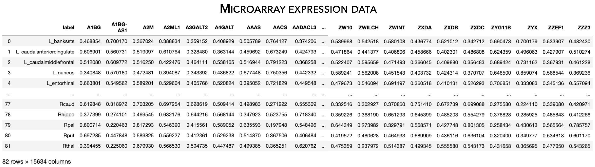

.. _gene_maps:

.. title:: Gene expression data

Gene expression data
======================================

This page contains descriptions and examples to fetch microarray expression data.

Fetch gene expression data
--------------------------------------
The **ENGMA TOOLBOX** provides microarray expression data collected from six human donor brains and released by 
`Allen Human Brain Atlas <https://human.brain-map.org/>`_. Microarray expression data were first generated using 
`abagen <https://github.com/rmarkello/abagen>`_ , a toolbox that provides reproducible workflows for processing 
and preparing gene co-expression data according to previously established recommendations (`Arnatkevic̆iūtė et al., 2019, NeuroImage <https://www.sciencedirect.com/science/article/abs/pii/S1053811919300114>`_); 
preprocessing steps included intensity-based filtering of microarray probes, selection of a representative probe 
for each gene across both hemispheres, matching of microarray samples to brain parcels from the 
`Desikan-Killiany 
<https://www.sciencedirect.com/science/article/abs/pii/S1053811906000437?via%3Dihub>`_, 
`Glasser <https://www.nature.com/articles/nature18933>`_, and 
`Schaefer <https://academic.oup.com/cercor/article/28/9/3095/3978804>`_ parcellations, 
normalization, and aggregation within parcels and across donors. Moreover, genes whose similarity across donors 
fell below a threshold (*r* < 0.2) were removed, leaving a total of 12,668 genes for analysis (using the Desikan-Killiany atlas). 
To accommodate users, we also provide unthresholded gene datasets with varying stability thresholds (*r* ≥ 0.2, *r* ≥ 0.4, 
*r* ≥ 0.6, *r* ≥ 0.8) for every parcellation (https://github.com/saratheriver/enigma-extra).

.. admonition:: Wanna know where we got those genes? 👖

     The Allen Human Brain Atlas microarray expression data loaded as part of the **ENIGMA TOOLBOX** was originally
     fetched from the `abagen <https://github.com/rmarkello/abagen>`_ toolbox using the ``abagen.get_expression_data()``
     command. For more flexibility, check out their toolbox!

.. admonition:: Got NaNs? 🥛

     Please note that two regions (right frontal pole and right temporal pole) in the Desikan-Killiany atlas were 
     not matched to any tissue sample and thus are filled with NaN values in the data matrix.

.. admonition:: Slow internet connection? 🐌

     The command ``fetch_ahba()`` fetches a large (~24 MB) microarray dataset from the internet and may thus be 
     incredibly slow to load if you lack a good connection. But don't you worry: you can download the
     relevant file by typing this command in your terminal ``wget https://github.com/saratheriver/enigma-extra/raw/master/ahba/allgenes_stable_r0.2.csv``
     and specifying its path in the ``fetch_ahba()`` function as follows:``fetch_ahba('/path/to/allgenes_stable_r0.2.csv')``

.. _fetch_genes:

.. tabs::

   .. code-tab:: py
       
        >>> from enigmatoolbox.datasets import fetch_ahba

        >>> # Fetch gene expression data
        >>> genes = fetch_ahba()

        >>> # Obtain region labels
        >>> reglabels = genes['label']

        >>> # Obtain gene labels
        >>> genelabels = list(genes.columns)[1]

   .. code-tab:: matlab

        % Fetch gene expression data
        genes = fetch_ahba();

        % Obtain region labels
        reglabels = genes.label;

        % Obtain gene labels
        genelabels = genes.Properties.VariableNames(2:end);  

