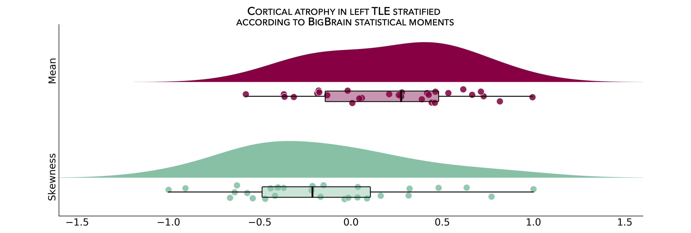
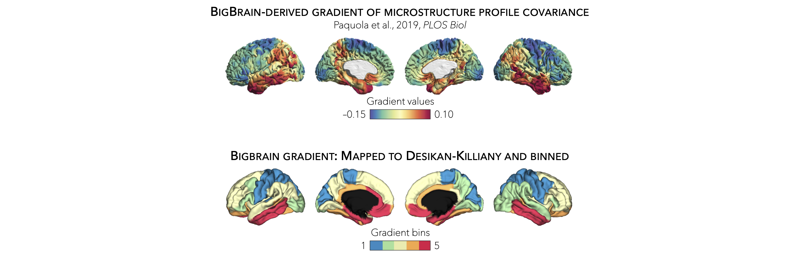
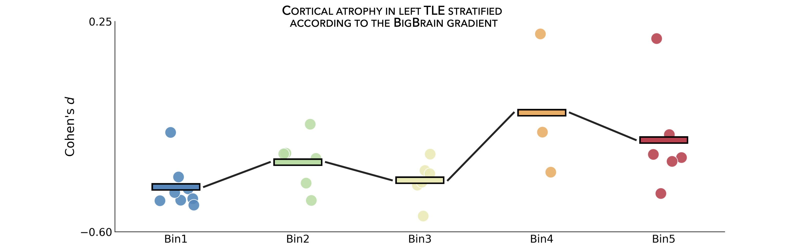

.. _big_brain:

.. title:: Big Brain histology

BigBrain moments & gradient
==================================================

This page contains descriptions and examples to stratify and visualize surface-based 
findings according to BigBrain statistical moments and gradient. 

BigBrain is a ultra-high resolution, 3D volumetric reconstruction of a *postmortem* 
Merker-stained and sliced human brain from a 65-year-old male, with specialized pial and 
white matter surface reconstructions (obtained via the open-access `BigBrain repository <https://bigbrain.loris.ca/main.php>`_. 
The *postmortem* brain was paraffin-embedded, coronally sliced into 7400 20μm sections, 
silver-stained for cell bodies, and digitized. A 3D reconstruction was implemented with a 
successive coarse-to-fine hierarchical procedure, resulting in a full brain volume. 
For the **ENIGMA TOOLBOX**, we used the highest resolution full brain volume (100μm isotropic voxels), 
then generated 50 equivolumetric surfaces between the pial and white matter surfaces. 
The equivolumetric model compensates for cortical folding by varying the Euclidean distance between pairs 
of intracortical surfaces throughout the cortex, thus preserving the fractional volume between surfaces. 
Next, staining intensity profiles, representing neuronal density and soma size by cortical depth, were 
sampled along 327,684 surface points in the direction of cortical columns.

.. _thr_map:

BigBrain statistical moments
--------------------------------------
As part of the **ENIGMA Toolbox**, we parametrized cytoarchitectural properties of the BigBrain by using two central moments 
(*i.e.*, mean and skewness) calculated across several cortical depths. 
In essence, studying the mean of BigBrain intensity profiles across the cortical mantle probes cellular/neuronal density, 
whereas analysis of skewness contrasts deep and superficial cortical layers, indexing the unevenness of cellular 
distribution, a critical dimension of laminar differentiation. 
Finally, the Desikan-Killiany atlas was nonlinearly transformed to the BigBrain histological surfaces `Lewis et al., 2019, OHBM <https://scholar.google.ca/scholar?hl=fr&as_sdt=0%2C5&q=An+extended+MSM+surface+registration+pipeline+to+bridge+atlases+across+the+MNI+and+the+FS%2FHCP+worlds&btnG=>`_ 
and central moments were averaged within each parcels, excluding outlier vertices with values more than three 
scaled median absolute deviations away from the parcel median. 

.. image:: ./examples/example_figs/bb_moments_orig.png
    :align: center

In the following example, we first threshold and display a cortical thickness map to highlight areas of marked atrophy in patients *vs*. controls 
(using left TLE *vs*. controls for the example below). 

.. parsed-literal:: 

     **Prerequisites**
     ↪ Load :ref:`summary statistics <load_sumstats>` **or** :ref:`example data <load_example_data>`
     ↪ :ref:`Z-score data <zscore_data>` (*mega only*)

.. tabs::

   .. code-tab:: py **Python** | meta

        >>> import numpy as np
        >>> from enigmatoolbox.plotting import plot_cortical
        >>> from enigmatoolbox.utils.parcellation import parcel_to_surface

        >>> # Extract FDR-corrected p-values and find regions with p < 0.01
        >>> region_idx = np.where(CT['fdr_p'].to_numpy() <= 0.01)

        >>> # Visualize thresholded Cohen's d map
        >>> CT_d_thr = np.zeros((68,))
        >>> CT_d_thr[region_idx] = CT_d.iloc[region_idx]
        >>> plot_cortical(array_name=parcel_to_surface(CT_d_thr, 'aparc_fsa5'), surface_name="fsa5", size=(800, 400),
        ...               cmap='RdBu_r', color_bar=True, color_range=(-0.5, 0.5))
     
   .. code-tab:: matlab **Matlab** | meta

        % Extract FDR-corrected p-values and find regions with p < 0.01
        region_idx  = find(CT.fdr_p <= 0.01);

        % Visualize thresholded Cohen's d map
        CT_d_thr              = zeros(length(CT_d), 1);
        CT_d_thr(region_idx)  = CT_d(region_idx);
        f = figure,
            plot_cortical(parcel_to_surface(CT_d_thr), 'color_range', [-0.5 0.5])

   .. tab:: ⤎ ⤏

          | ⤎ If you have **meta**-analysis data (*e.g.*, summary statistics)
          | ⤏ If you have individual site or **mega**-analysis data

   .. code-tab:: py **Python** | mega

        >>> import numpy as np
        >>> from enigmatoolbox.plotting import plot_cortical
        >>> from enigmatoolbox.utils.parcellation import parcel_to_surface

        >>> # Extract regions with z-score < -1
        >>> region_idx = np.where(CT_z_mean.to_numpy() <= -1)

        >>> # Visualize z-score thresholded map
        >>> CT_z_mean_thr = np.zeros((68,))
        >>> CT_z_mean_thr[region_idx] = CT_z_mean.iloc[region_idx]
        >>> plot_cortical(array_name=parcel_to_surface(CT_z_mean_thr, 'aparc_fsa5'), surface_name="fsa5", 
        ...               size=(800, 400), cmap='RdBu_r', color_bar=True, color_range=(-1, 1))

   .. code-tab:: matlab **Matlab** | mega

        % Extract regions with z-score < -1
        region_idx  = find(CT_z_mean{:, :} <= -1);

        % Visualize z-score thresholded map
        CT_z_mean_thr              = zeros(length(CT_z_mean{:, :}), 1);
        CT_z_mean_thr(region_idx)  = CT_z_mean{:, :}(region_idx);
        f = figure,
            plot_cortical(parcel_to_surface(CT_z_mean_thr), 'color_range', [-1 1])

.. _bb_moments:

From the following code snippet, we can then contextualize and visualize these marked patterns of atrophy with respect to intensity profiles 
reflecting microstructural composition (*e.g.*, cellular density, cellular distribution asymmetry) along cortical columns.

.. parsed-literal:: 

     **Prerequisites**
     ↪ Load :ref:`summary statistics <load_sumstats>` **or** :ref:`example data <load_example_data>`
     ↪ :ref:`Z-score data <zscore_data>` (*mega only*)
     ↪ :ref:`Threshold surface maps <thr_map>`

.. tabs::

   .. code-tab:: py 
       
        >>> from enigmatoolbox.histology import bb_moments_raincloud
        
        >>> # Stratify and plot results according to BigBrain statistical moments
        >>> bb_moments_raincloud(region_idx=region_idx)

   .. code-tab:: matlab 

        % Stratify and plot results according to BigBrain statistical moments
        f = figure,
            bb_moments_raincloud(region_idx)

|

.. _bb_gradient:

BigBrain gradient
--------------------------------------
In addition to statistical moments, we also incorporated the BigBrain microstructural profile covariance (MPC) gradient from the original publication 
(`Paquola et al., 2019, PLoS Biol <https://journals.plos.org/plosbiology/article?id=10.1371/journal.pbio.3000284>`_). In brief, 
the authors derived an MPC matrix by correlating BigBrain intensity profiles between every pair of regions in a 1,012 cortical node parcellation, 
controlling for the average whole-cortex intensity profile. The MPC matrix was thresholded row-wise to retain the top 10% of correlations and 
converted into a normalized angle matrix. Diffusion map embedding, a nonlinear manifold learning technique, identified the principal axis 
of variation across cortical areas, *i.e.*, the BigBrain gradient. In this space, cortical nodes that are strongly similar are closer together, 
whereas nodes with little to no intercovariance are farther apart. 

To allow contextualization of ENIGMA-derived surface-based findings, 
we mapped the BigBrain gradient, which describes a sensory-fugal transition in intracortical microstructure, 
to the Desikan-Killiany atlas and partitioned it into five equally sized discrete bins. 
Stratifying cortical findings relative to this gradient can, 
for example, test whether patterns of changes are conspicuous in cortices with marked laminar differentiation (*e.g.*, 1st bin; sensory and motor cortices) 
or in those with subtle laminar differentiation (*e.g.*, 5th bin limbic cortices). 

In the following example, we can use our thresholded (or unthresholded) a cortical map (*e.g.*, cortical thickness effect sizes) to contextualize and visualize 
patterns of marked atrophy with respect to each gradient bin.

.. parsed-literal:: 

     **Prerequisites**
     ↪ Load :ref:`summary statistics <load_sumstats>` **or** :ref:`example data <load_example_data>`
     ↪ :ref:`Z-score data <zscore_data>` (*mega only*)
     ↪ :ref:`Threshold surface maps <thr_map>`

.. tabs::

   .. code-tab:: py **Python** | meta
       
        >>> import numpy as np
        >>> from enigmatoolbox.histology import bb_gradient_plot

        >>> # Stratify and plot results according to the BigBrain gradient
        >>> bb_gradient_plot(data=np.where(CT_d_thr == 0, np.nan, CT_d_thr),
        ...               axis_range=(-0.6, 0.25), yaxis_label='Cohen\'s $d$')

   .. code-tab:: matlab **Matlab** | meta

        % Stratify and plot results according to the BigBrain gradient
        CT_d_thr(CT_d_thr == 0) = nan;
        f = figure, 
            bb_gradient_plot(CT_d_thr, 'axis_range', [-0.6 0.25], ...
                        'yaxis_label', 'Cohen'' {\it d}')

   .. tab:: ⤎ ⤏

          | ⤎ If you have **meta**-analysis data (*e.g.*, summary statistics)
          | ⤏ If you have individual site or **mega**-analysis data

   .. code-tab:: py **Python** | mega

        >>> import numpy as np
        >>> from enigmatoolbox.histology import bb_gradient_plot

        >>> # Stratify and plot results according to the BigBrain gradient
        >>> bb_gradient_plot(data=np.where(CT_z_mean_thr == 0, np.nan, CT_z_mean_thr),
        ...               axis_range=(-2, -0.75), yaxis_label='$z$-score')

   .. code-tab:: matlab **Matlab** | mega
       
        % Stratify and plot results according to the BigBrain gradient
        CT_z_mean_thr(CT_z_mean_thr == 0) = nan;
        f = figure, 
            bb_gradient_plot(CT_z_mean_thr, 'axis_range', [-2 -0.75], ...
                        'yaxis_label', '{\it z}-score')
        
