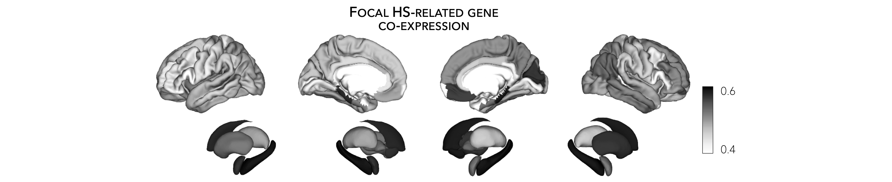

.. _ep_genes:

.. title:: Disease-related genes

Disease-related transcriptomics
=========================================

This page contains descriptions and examples to extract GWAS-implicated gene expression data
and project them to cortical and subcortical surfaces. In the following tutorial, we will use epilepsy-related genes 
(more specifically, genes related to hippocampal sclerosis) as an example, but feel free to replace *epilepsy* with 
any other disorder listed below.

Extract disease-related genes
-----------------------------------------
| As part of the **ENIGMA TOOLBOX**, users can query pre-defined lists of disease-related genes (obtained from several recently published GWAS), including gene sets for:
| ↪ `attention deficit/hyperactivity disorder <https://www.nature.com/articles/s41588-018-0269-7>`_
| ↪ `autism spectrum disorder <https://www.nature.com/articles/s41588-019-0344-8>`_
| ↪ `bipolar disorder <https://www.nature.com/articles/s41588-019-0397-8>`_
| ↪ `depression <https://www.nature.com/articles/s41593-018-0326-7>`_
| ↪ `common epilepsies <https://www.nature.com/articles/s41467-018-07524-z>`_ 📸
| ↪ `schizophrenia <https://www.nature.com/articles/s41588-018-0059-2>`_
| ↪ `tourette's syndrome <https://ajp.psychiatryonline.org/doi/10.1176/appi.ajp.2018.18070857?url_ver=Z39.88-2003&rfr_id=ori:rid:crossref.org&rfr_dat=cr_pub%20%200pubmed>`_ 

\* 📸 *indicates disease-related genes used in the code snippets.*

.. admonition:: Caution ⚠️

     Pre-defined gene sets are obtained from individual studies and are liable to be changed.
     We welcome any suggestions you may have on defining proper disease-related gene sets and are
     happy to expand this function to include other interesting disorders. Get in touch with us
     `here <https://github.com/saratheriver/ENIGMA/issues>`_.

.. parsed-literal:: 

     **Prerequisites**
     ↪ Fetch :ref:`gene expression data <fetch_genes>`

.. _epi_genes:

.. tabs::

   .. code-tab:: py
       
        >>> from enigmatoolbox.datasets import risk_genes

        >>> # Get the names of epilepsy-related genes (Focal HS phenotype)
        >>> epilepsy_genes = risk_genes('epilepsy')['focalhs']

        >>> # Extract gene expression data for these Focal HS genes
        >>> epilepsy_gene_data = genes[genes.columns.intersection(epilepsy_genes)]

   .. code-tab:: matlab

        % Get the names of epilepsy-related genes (Focal HS phenotype)
        epilepsy_genes = risk_genes('epilepsy');
        epilepsy_genes = epilepsy_genes.focalhs;

        % Extract gene expression data for these Focal HS genes
        epilepsy_gene_data = genes(:, ismember(genes.Properties.VariableNames, ...
                                   epilepsy_genes));

|

Visualize disease-related gene expression maps
------------------------------------------------------------------------
Following up on the above example, we provide a brief example to project gene expression maps to the surface. 
Once again, we use genes related to hippocampal sclerosis as an example.

.. parsed-literal:: 

     **Prerequisites**
     ↪ Fetch :ref:`gene expression data <fetch_genes>`
     ↪ Extract :ref:`disease-related gene data <epi_genes>`

.. tabs::

   .. code-tab:: py
       
        >>> import numpy as np
        >>> from enigmatoolbox.utils.parcellation import parcel_to_surface
        >>> from enigmatoolbox.plotting import plot_cortical, plot_subcortical

        >>> # Compute the mean co-expression across all Focal HS genes
        >>> mean_epilepsy_genes = np.mean(epilepsy_gene_data, axis=1)

        >>> # Separate cortical (ctx) from subcortical (sctx) regions
        >>> mean_epilepsy_genes_ctx = mean_epilepsy_genes[:68]
        >>> mean_epilepsy_genes_sctx = mean_epilepsy_genes[68:]

        >>> # Map the parcellated gene expression data to our surface template (cortical values only)
        >>> mean_epilepsy_genes_ctx_fsa5 = parcel_to_surface(mean_epilepsy_genes_ctx, 'aparc_fsa5')

        >>> # Project the results on the surface brain
        >>> plot_cortical(array_name=mean_epilepsy_genes_ctx_fsa5, surface_name="fsa5", size=(800, 400), nan_color=(1, 1, 1, 1),
        ...               cmap='Greys', color_bar=True, color_range=(0.4, 0.6))

        >>> plot_subcortical(array_name=mean_epilepsy_genes_sctx, ventricles=False, size=(800, 400),
        ...                 cmap='Greys', color_bar=True, color_range=(0.4, 0.6))

   .. code-tab:: matlab

        % Compute the mean co-expression across all Focal HS genes
        mean_epilepsy_genes = mean(epilepsy_gene_data{:, :}, 2);

        % Separate cortical (ctx) from subcortical (sctx) regions
        mean_epilepsy_genes_ctx  = mean_epilepsy_genes(1:68);
        mean_epilepsy_genes_sctx = mean_epilepsy_genes(69:end);

        % Map the parcellated gene expression data to our surface template (cortical values only)
        mean_epilepsy_genes_ctx_fsa5 = parcel_to_surface(mean_epilepsy_genes_ctx, 'aparc_fsa5');

        % Project the results on the surface brain
        f = figure,
            plot_cortical(mean_epilepsy_genes_ctx_fsa5, 'color_range', ...
                          [0.4 0.6], 'cmap', 'Greys')

        f = figure,
            plot_subcortical(mean_epilepsy_genes_sctx, 'ventricles', 'False', ...
                             'color_range', [0.4 0.6], 'cmap', 'Greys')

