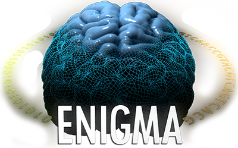
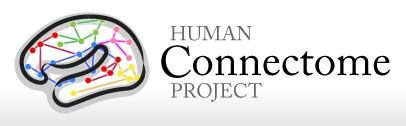

.. _funding:

.. title:: Thank you to our funders and collaborators! 💙

Acknowledgements
======================================
The authors would like to express their gratitude to the open science initiatives that made this work possible:
    
**The ENIGMA Consortium**

|

|

|

|

|

**The Human Connectome Project**

|

|

|

|

**Allen Human Brain Atlas**

.. image:: ./examples/example_figs/ahba.jpg
    :align: left
    :scale: 25%
    :target: https://human.brain-map.org/
    :alt: AHBA

|

|

|

|

|

|

We would also like to recognise funding support from the Canadian Institutes of Health Research (CIHR) and Fonds de la recherche en santé du Québec (FRQS).
Core funding for ENIGMA was provided by the NIH Big Data to Knowledge (BD2K) program under consortium grant U54
EB020403, by the ENIGMA World Aging Center (R56 AG058854), and
by the ENIGMA Sex Differences Initiative (R01 MH116147).

.. raw:: html

    

| And finally, a many thanks to our wonderful enigmator collaborators 🦀
| - **Casey Paquola**, *MICA Lab - Montreal Neurological Institute*
| - **Jessica Royer**, *MICA Lab - Montreal Neurological Institute*
| - **Bo-Yong Park**, *MICA Lab - Montreal Neurological Institute*
| - **Oualid Benkarim**, *MICA Lab - Montreal Neurological Institute*
| - **Raúl Rodríguez-Cruces**, *MICA Lab - Montreal Neurological Institute*
| - **Nicole Eichert**, *MICA Lab - Montreal Neurological Institute*