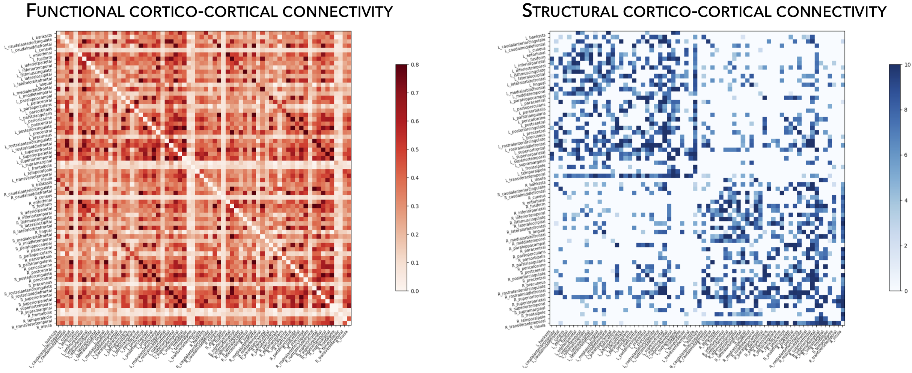

.. _hcp_connectivity:

.. title:: Free connectivity data! ⏳

Functional and structural connectivity data
==================================================

This page contains descriptions and examples to use HCP connectivity data!
For details on HCP participants and data processing, please see our manuscript entitled 
`Network-based atrophy modelling in the common epilepsies: a worldwide ENIGMA study <https://www.biorxiv.org/content/10.1101/2020.05.04.076836v1>`_

.. _load_corticocortical:

Load cortical connectivity matrices
----------------------------------------
The **ENIGMA TOOLBOX** provides structural (diffusion MRI) and functional 
(resting-state functional MRI) connectivity matrices obtained from the Human Connectome Project (HCP). 
Following the examples below, we can load connectivity data and extract seed-based connectivity. 

.. admonition:: Oh, by the way... ☝🏼

     Seed-based connectivity, as well as various connectivity metrics, can be easily mapped onto 
     the surface template! Simply follow our tutorial :ref:`here <surf_visualization>`!

.. tabs::

   .. code-tab:: py
       
        >>> from enigmatoolbox.datasets import load_sc, load_fc
        >>> from nilearn import plotting

        >>> # Load and plot functional connectivity data
        >>> fc, fcl, _, _ = load_fc()
        >>> fc_plot = plotting.plot_matrix(fc, figure=(9, 9), labels=fcl, vmax=0.8, vmin=0, cmap='Reds')

        >>> # Load and plot structural connectivity data
        >>> sc, scl, _, _ = load_sc()
        >>> sc_plot = plotting.plot_matrix(sc, figure=(9, 9), labels=scl, vmax=10, vmin=0, cmap='Blues')

        >>> # We can also extract seed-based connectivity! Let's pick the middle temporal gyrus as example seed:
        >>> seed = "L_middletemporal"
        >>> seed_conn_fc = fc[[i for i, item in enumerate(fcl) if seed in item],]   # extract FC row corresponding to the seed
        >>> seed_conn_sc = sc[[i for i, item in enumerate(scl) if seed in item],]   # extract SC row corresponding to the seed

   .. code-tab:: matlab

        %% Add the path to the ENIGMA TOOLBOX matlab folder
        addpath(genpath('/path/to/ENIGMA/matlab/'));

        %% Load and plot functional connectivity data
        [fc, fcl, ~, ~] = load_fc();
        f = figure,
          imagesc(fc, [0 0.8]);                    % change axis limits here
          colormap(Reds);                          % change colormap here
          colorbar;                                % display colorbar
          set(gca, 'YTick', 1:1:length(fcl), ...   % display name of regions on y-axis
              'YTickLabel', fcl)    

        %% Load and plot structural connectivity data
        [sc, scl, ~, ~] = load_sc();
        f = figure,
          imagesc(sc, [0 10]);                     % change axis limits here
          colormap(Blues);                         % change colormap here
          colorbar;                                % display colorbar
          set(gca, 'YTick', 1:1:length(scl), ...   % display name of regions on y-axis
              'YTickLabel', scl)    

        %% We can also extract seed-based connectivity! Let's pick the middle temporal gyrus as example seed:
        seed = 'L_middletemporal'
        seed_conn_fc = fc(find(strcmp(scl, seed)), :)   % extract FC row corresponding to the seed
        seed_conn_sc = sc(find(strcmp(scl, seed)), :)   % extract SC row corresponding to the seed
     

|

.. _load_subcorticocortical:

Load subcortical connectivity matrices
-------------------------------------------
| Subcortico-cortical as well as subcortico-subcortical connectivity matrices are also included in the
 **ENIGMA TOOLBOX**! As above, we can load these structural and functional matrices and extract seed-based connectivity
 from subcortical seeds!

.. tabs::

   .. code-tab:: py

        >>> from enigmatoolbox.datasets import load_sc, load_fc
        >>> from nilearn import plotting

        >>> # Let's use load_sc() and load_fc() functions to return:
        >>> # 14 x 68 ndarray (fc/sc: subcortico-cortical connectivity matrix)
        >>> # 14 x 1 ndarray (fcl/scl: name of subcortical areas)

        >>> # Load and plot functional connectivity data
        >>> _, _, fc, fcl = load_fc()
        >>> fc_plot = plotting.plot_matrix(fc, figure=(9, 9), labels=fcl, vmax=0.5, vmin=0, cmap='Reds')

        >>> # Load and plot structural connectivity data
        >>> _, _, sc, scl = load_sc()
        >>> sc_plot = plotting.plot_matrix(sc, figure=(9, 9), labels=scl, vmax=10, vmin=0, cmap='Blues')

        >>> # As above, we can also extract seed-based connectivity! Here, we chose the left hippocampus as example seed:
        >>> seed = "Lhippo"
        >>> seed_conn_fc = fc[[i for i, item in enumerate(fcl) if seed in item],]   # extract FC row corresponding to the seed
        >>> seed_conn_sc = sc[[i for i, item in enumerate(scl) if seed in item],]   # extract SC row corresponding to the seed

   .. code-tab:: matlab

        %% Add the path to the ENIGMA TOOLBOX matlab folder
        addpath(genpath('/path/to/ENIGMA/matlab/'));

        %% Let's use load_sc() and load_fc() functions to return:
        % 14 x 68 matrix (fc/sc: subcortico-cortical connectivity matrix)
        % 1 x 14 cell array (fcl/scl: name of subcortical areas)  

        %% Load and plot functional connectivity data
        [~, ~, fc, fcl] = load_fc();
        f = figure,
          imagesc(fc, [0 0.5]);                    % change axis limits here
          colormap(Reds);                          % change colormap here
          colorbar;                                % display colorbar
          set(gca, 'YTick', 1:1:length(fcl), ...   % display name of regions on y-axis
              'YTickLabel', fcl)    

        %% Load and plot structural connectivity data
        [~, ~, sc, scl] = load_sc();
        f = figure,
          imagesc(sc, [0 10]);                     % change axis limits here
          colormap(Blues);                         % change colormap here
          colorbar;                                % display colorbar
          set(gca, 'YTick', 1:1:length(scl), ...   % display name of regions on y-axis
              'YTickLabel', scl)    

        %% We can also extract seed-based connectivity! Let's pick the middle temporal gyrus as example seed:
        seed = 'Lhippo'
        seed_conn_fc = fc(find(strcmp(scl, seed)), :)   % extract FC row corresponding to the seed
        seed_conn_sc = sc(find(strcmp(scl, seed)), :)   % extract SC row corresponding to the seed

.. image:: ./examples/example_figs/sctx_conn.png
    :align: center