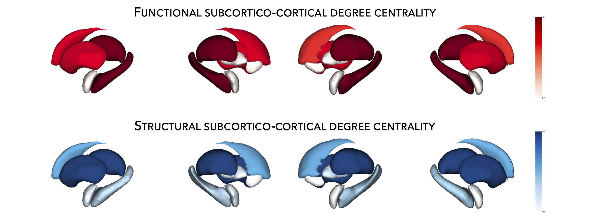

.. _hubs_susceptibility:

.. title:: Hub susceptibility model! 🛩

Hub susceptibility
======================================

This page contains descriptions and examples to build hub susceptibility models!

.. _cortical_hubs:

Cortical hubs
------------------------------------------
Using the :ref:`HCP connectivity data <hcp_connectivity>`, we can then compute weighted (optimal for unthresholded connectivity
matrices) degree centrality to identify structural and functional hub regions. This is done by simply 
computing the sum of all weighted cortico-cortical connections for every region. Higher degree centrality 
denotes increased hubness (*i.e.*, node with many connections).

.. parsed-literal:: 

     **Dependent steps**
     ↪ :ref:`Load cortico-cortical connectivity matrices <load_corticocortical>`

.. tabs::

   .. code-tab:: py **Python** | meta
     
          ello

   .. code-tab:: matlab **Matlab** | meta

          ello

   .. tab:: ⤎ ⤏

          | ⤎ If you have **meta**-analysis data (*e.g.*, summary statistics)
          | ⤏ If you have individual site or **mega**-analysis data

   .. code-tab:: py **Python** | mega
       
        >>> import numpy as np
        >>> from enigmatoolbox.plotting import plot_cortical
        >>> from enigmatoolbox.utils.parcellation import parcel_to_surface

        >>> # Compute weighted degree centrality measures from the connectivity data
        >>> dc_f = np.sum(fc, axis=0)
        >>> dc_s = np.sum(sc, axis=0)

        >>> # Map parcellated data to the surface
        >>> dc_f_fsa5 = parcel_to_surface(dc_f, 'aparc_fsa5')
        >>> dc_s_fsa5 = parcel_to_surface(dc_s, 'aparc_fsa5')

        >>> # And project the results on the surface brain
        >>> plot_cortical(array_name=dc_f_fsa5, surface_name="fsa5", size=(800, 400),
        ...               cmap='Reds', color_bar=True, color_range=(20, 30))

        >>> plot_cortical(array_name=dc_s_fsa5, surface_name="fsa5", size=(800, 400),
        ...               cmap='Blues', color_bar=True, color_range=(100, 300))

   .. code-tab:: matlab **Matlab** | mega

        %% Add the path to the ENIGMA TOOLBOX matlab folder
        addpath(genpath('/path/to/ENIGMA/matlab/'));

        %% Compute weighted degree centrality measures from the connectivity data
        dc_f                = sum(fc);
        dc_s                = sum(sc);

        %% Map parcellated data to the surface
        dc_f_fsa5           = parcel_to_surface(dc_f, 'aparc_fsa5');
        dc_s_fsa5           = parcel_to_surface(dc_s, 'aparc_fsa5');

        %% And project the results on the surface brain
        f = figure,
          plot_cortical(dc_f_fsa5, 'fsa5', 'functional degree centrality')
          colormap([Reds])
          colorbar_range([20 30])
     
        f = figure,
          plot_cortical(dc_s_fsa5, 'fsa5', 'structural degree centrality')
          colormap([Blues])
          colorbar_range([100 300]) 

.. image:: ./examples/example_figs/hubs_ctx.png
    :align: center

|

.. _subcortical_hubs:

Subcortical hubs
---------------------------------------------
The :ref:`HCP connectivity data <surf_visualization>` can also be used to identify structural 
and functional subcortico-cortical hub regions. As above, we simply compute the sum of all weighted 
subcortico-cortical connections for every subcortical area. Once again, higher degree centrality 
denotes increased hubness!

.. parsed-literal:: 

     **Dependent steps**
     ↪ :ref:`Load subcortico-cortical connectivity matrices <load_subcorticocortical>`

.. Attention:: 
     Because we do not have connectivity values for the ventricles, do make sure to set 
     the "ventricles" flag to ``False`` when displaying the findings on the subcortical surfaces!

.. tabs::

   .. code-tab:: py **Python** | meta
     
          ello

   .. code-tab:: matlab **Matlab** | meta

          ello

   .. tab:: ⤎ ⤏

          | ⤎ If you have **meta**-analysis data (*e.g.*, summary statistics)
          | ⤏ If you have individual site or **mega**-analysis data

   .. code-tab:: py **Python** | mega

        >>> import numpy as np
        >>> from enigmatoolbox.plotting import plot_subcortical

        >>> # Compute weighted degree centrality measures from the connectivity data
        >>> dc_f = np.sum(fc, axis=1)
        >>> dc_s = np.sum(sc, axis=1)

        >>> # And project the results on the subcortical surfaces (don't forget to set the ventricles flag to False!)
        >>> plot_subcortical(array_name=dc_f, ventricles=False, size=(800, 400),
        ...                  cmap='Reds', color_bar=True, color_range=(5, 10))

        >>> plot_subcortical(array_name=dc_s, ventricles=False, size=(800, 400),
        ...                  cmap='Blues', color_bar=True, color_range=(100, 300))

   .. code-tab:: matlab **Matlab** | mega

        %% Add the path to the ENIGMA TOOLBOX matlab folder
        addpath(genpath('/path/to/ENIGMA/matlab/'));

        %% Compute weighted degree centrality measures from the connectivity data
        dc_f                = sum(fc, 2);
        dc_s                = sum(sc, 2);

        %% And project the results on the subcortical surfaces (don't forget to set the ventricles flag to 'False'!
        f = figure,
          plot_subcortical(dc_f, 'False', 'functional degree centrality')
          colormap([Reds])
          colorbar_range([5 10])
     
        f = figure,
          plot_subcortical(dc_s, 'False', 'structural degree centrality')
          colormap([Blues])
          colorbar_range([100 300])

|

Hub-atrophy correlations
-------------------------------------------------------
Now that we have established the spatial distribution of hubs in the brain, we can then assess 
whether there is a selective vulnerability of these hub regions that parallels syndrome-specific atrophy patterns.
For simplicity, in the following example, we will spatially correlate degree centrality measures to 
*z*-scored cortical thickness and subcortical volume measures (with lower values indicating greater 
atrophy relative to controls).

.. parsed-literal:: 

     **Dependent steps**
     ↪ Load :ref:`summary statistics <load_sumstats>` **or** :ref:`example data <load_example_data>`
     ↪ :ref:`Re-order subcortical data <reorder_sctx>` (*individual site/mega-analysis data only*)
     ↪ :ref:`Z-score data <zscore_data>` (*individual site/mega-analysis data only*)
     ↪ Load :ref:`cortico-cortical <load_corticocortical>` and :ref:`subcortico-cortical <load_subcorticocortical>` connectivity matrices
     ↪ Compute :ref:`cortical-cortical <cortical_hubs>` and :ref:`subcortico-cortical <cortical_hubs>` degree centrality
     
.. tabs::

   .. code-tab:: py **Python** | meta
     
          ello

   .. code-tab:: matlab **Matlab** | meta

          ello

   .. tab:: ⤎ ⤏

          | ⤎ If you have **meta**-analysis data (*e.g.*, summary statistics)
          | ⤏ If you have individual site or **mega**-analysis data

   .. code-tab:: py **Python** | mega

        >>> import numpy as np

        >>> # Let's first remove subcortical values corresponding the ventricles (as we don't have connectivity values for them!)
        >>> metr1_SubVol_r = metr1_SubVol_r.drop(columns=['LLatVent', 'RLatVent'])

        >>> # Perform spatial correlations between functional hubs and atrophy
        >>> fc_ctx_r = np.corrcoef(fc_ctx_dc, ct_tle)[0, 1]
        >>> fc_sctx_r = np.corrcoef(fc_sctx_dc, sv_tle)[0, 1]

        >>> # Perform spatial correlations between structural hubs and atrophy
        >>> sc_ctx_r = np.corrcoef(sc_ctx_dc, ct_tle)[0, 1]
        >>> sc_sctx_r = np.corrcoef(sc_sctx_dc, sv_tle)[0, 1]

   .. code-tab:: matlab **Matlab** | mega

        % Add the path to the ENIGMA TOOLBOX matlab folder
        addpath(genpath('/path/to/ENIGMA/matlab/'));

        % Let's first remove subcortical values corresponding the ventricles (as we don't have connectivity values for them!)
        metr1_SubVol_r.LLatVent                 = [];
        metr1_SubVol_r.RLatVent                 = [];

        % Perform spatial correlations between functional hubs and atrophy
        fc_ctx_r     = corrcoef(fc_ctx_dc, ct_tle);
        fc_sctx_r    = corrcoef(fc_sctx_dc, sv_tle);

        % Perform spatial correlations between structural hubs and atrophy
        sc_ctx_r    = corrcoef(sc_ctx_dc, ct_tle);
        sc_sctx_r   = corrcoef(sc_sctx_dc, sv_tle);

|

Spin permutation tests
-------------------------------------------------------
The intrinsic spatial smoothness in two given **cortical maps** may inflate the significance of their spatial correlation. 
To overcome this challenge, we assess statistical significance using *spin permutation tests*. 
To do so, we generate null models of overlap between cortical maps by projecting the spatial 
coordinates of cortical data onto the surface spheres, apply randomly sampled rotations, 
and reassign cortical values. We then compare the original correlation coefficients against 
the empirical distribution determined by the ensemble of spatially permuted correlation coefficients. 

| 
     To compare spatial overlap between **subcortical maps**, we employed a similar approach with the exception 
     that subcortical labels were randomly shuffled as opposed to being projected onto spheres.    

.. tabs::

   .. code-tab:: py **Python** | meta
     
          ello

   .. code-tab:: matlab **Matlab** | meta

          ello

   .. tab:: ⤎ ⤏

          | ⤎ If you have **meta**-analysis data (*e.g.*, summary statistics)
          | ⤏ If you have individual site or **mega**-analysis data

   .. code-tab:: py **Python** | mega

        >>> from enigmatoolbox.permutation_testing import spin_test, shuf_test

        >>> # Spin permutation testing for two cortical maps
        >>> fc_ctx_p, fc_ctx_d = spin_test(dc_f, ct_tle.to_numpy(), surface_name='fsa5', parcellation_name='aparc',
        >>>                                n_rot=1000, type='pearson', spin_dist=True)
        >>> sc_ctx_p, sc_ctx_d = spin_test(dc_s, ct_tle.to_numpy(), surface_name='fsa5', parcellation_name='aparc', 
        >>>                                n_rot=100, type='pearson', spin_dist=True)

        >>> # Shuf permutation testing for two subcortical maps
        >>> fc_sctx_p, fc_sctx_d = shuf_test(dc_f, sv_tle.to_numpy(), n_rot=1000, type='pearson', spin_dist=True)
        >>> sc_sctx_p, sc_sctx_d = shuf_test(dc_s, sv_tle.to_numpy(), n_rot=1000, type='pearson', spin_dist=True)

   .. code-tab:: matlab **Matlab** | mega

        %% Add the path to the ENIGMA TOOLBOX matlab folder
        addpath(genpath('/path/to/ENIGMA/matlab/'));

        % Spin permutation testing for two cortical maps
        [fc_ctx_p, fc_ctx_d]  = spin_test(dc_f, ct_tle, 'fsa5', 'aparc', 1000, 'pearson');
        [sc_ctx_p, sc_ctx_d]  = spin_test(dc_s, ct_tle, 'fsa5', 'aparc', 1000, 'pearson');

        % Shuf permutation testing for two subcortical maps 
        [fc_sctx_p, fc_sctx_d] = shuf_test(dc_f, sv_tle, 1000, 'pearson');
        [sc_sctx_p, sc_sctx_d] = shuf_test(dc_s, sv_tle, 1000, 'pearson');

|

Plot hub-atrophy correlations
------------------------------------------------------------------------
Now that we have done all the necessary analyses, we can finally display our correlations! 
Here, a negative correlation indicates that greater atrophy (negative z-score values) correlates 
with the spatial distribution of hub regions (greater degree centrality).  

.. tabs::

   .. code-tab:: py **Python** | meta
     
          ello

   .. code-tab:: matlab **Matlab** | meta

          ello

   .. tab:: ⤎ ⤏

          | ⤎ If you have **meta**-analysis data (*e.g.*, summary statistics)
          | ⤏ If you have individual site or **mega**-analysis data

   .. code-tab:: py **Python** | mega

        >>> import matplotlib.pyplot as plt
        >>> import matplotlib.gridspec as gridspec
        >>> from enigmatoolbox.plotting import enigma_scatter

        >>> fig = plt.figure(constrained_layout=True, figsize=(15, 3))
        >>> gs = gridspec.GridSpec(1, 4, figure=fig)

        >>> # Functional cortical hubs and cortical thickness
        >>> ax1 = fig.add_subplot(gs[0, 0])
        >>> enigma_scatter(ax1, fc_ctx_dc, ct_tle, scatter_color='#A8221C', linear_fit=True, fit_color='#A8221C',
        >>>                xlabel='Cortico-cortical degree centrality', ylabel='Cortical thickness (z-score)',
        >>>                xlim=(5, 30), ylim=(-2, 1), corr_value=fc_ctx_r, p_value=fc_ctx_p)

        >>> # Functional subcortical hubs and subcortical volume
        >>> ax2 = fig.add_subplot(gs[0, 1])
        >>> enigma_scatter(ax2, fc_sctx_dc, sv_tle, scatter_color='#A8221C', linear_fit=True, fit_color='#A8221C',
        >>>                xlabel='Subcortico-cortical degree centrality', ylabel='Subcortical volume (z-score)',
        >>>                xlim=(1, 13), ylim=(-3.5, 0), corr_value=fc_sctx_r, p_value=fc_sctx_p, p_type='shuf')

        >>> # Structural cortical hubs and cortical thickness
        >>> ax3 = fig.add_subplot(gs[0, 2])
        >>> enigma_scatter(ax3, sc_ctx_dc, ct_tle, scatter_color='#324F7D', linear_fit=True, fit_color='#324F7D',
        >>>                xlabel='Cortico-cortical degree centrality', ylabel='Cortical thickness (z-score)',
        >>>                xlim=(0, 350), ylim=(-2, 1), corr_value=sc_ctx_r, p_value=sc_ctx_p)

        >>> # Functional subcortical hubs and subcortical volume
        >>> ax4 = fig.add_subplot(gs[0, 3])
        >>> enigma_scatter(ax4, sc_sctx_dc, sv_tle, scatter_color='#324F7D', linear_fit=True, fit_color='#324F7D',
        >>>                xlabel='Subcortico-cortical degree centrality', ylabel='Subcortical volume (z-score)',
        >>>                xlim=(90, 375), ylim=(-3.5, 0), corr_value=sc_sctx_r, p_value=sc_sctx_p, p_type='shuf')

   .. code-tab:: matlab **Matlab** | mega

        %% Add the path to the ENIGMA TOOLBOX matlab folder
        addpath(genpath('/path/to/ENIGMA/matlab/'));

        %% Create figure
        f = figure,
            set(gcf,'color','w');
            set(gcf,'units','normalized','position',[0 0 1 0.3])
    
            %% Functional cortical hubs and cortical thickness
            ax1 = subplot(1, 4, 1); hold on
            enigma_scatter(ax1, fc_ctx_dc, CortThick_Z_LTLE_mean{:, :}, 'scatter_color', [0.66 0.13 0.11], ...
                           'linear_fit', 1, 'fit_color', [0.66 0.13 0.11], 'xlabel', 'Cortico-cortical degree centrality', ...
                           'ylabel', 'Cortical thickness (z-score)', 'xlim', [5 30], 'ylim', [-2 1], ...
                           'corr_value', fc_ctx_r(1, 2), 'p_value', fc_ctx_p, 'p_type', 'spin')
        
            %% Functional subcortical hubs and subcortical volume
            ax2 = subplot(1, 4, 2); hold on
            enigma_scatter(ax2, fc_sctx_dc.', SubVol_Z_LTLE_r_mean_noVent{:, :}, 'scatter_color', [0.66 0.13 0.11], ...
                           'linear_fit', 1, 'fit_color', [0.66 0.13 0.11], 'xlabel', 'Subcortico-cortical degree centrality', ...
                           'ylabel', 'Subcortical volume (z-score)', 'xlim', [1 13], 'ylim', [-3.5 0], ...
                           'corr_value', fc_sctx_r(1, 2), 'p_value', fc_sctx_p, 'p_type', 'shuf')
        
            %% Structural cortical hubs and cortical thickness
            ax3 = subplot(1, 4, 3); hold on
            enigma_scatter(ax3, sc_ctx_dc, CortThick_Z_LTLE_mean{:, :}, 'scatter_color', [0.20 0.33 0.49], ...
                           'linear_fit', 1, 'fit_color', [0.20 0.33 0.49], 'xlabel', 'Cortico-cortical degree centrality', ...
                           'ylabel', 'Cortical thickness (z-score)', 'xlim', [0 350], 'ylim', [-2 1], ...
                           'corr_value', sc_ctx_r(1, 2), 'p_value', sc_ctx_p, 'p_type', 'spin')
        
            %% Structural subcortical hubs and subcortical volume
            ax4 = subplot(1, 4, 4); hold on
            enigma_scatter(ax4, sc_sctx_dc.', SubVol_Z_LTLE_r_mean_noVent{:, :}, 'scatter_color', [0.20 0.33 0.49], ...
                           'linear_fit', 1, 'fit_color', [0.20 0.33 0.49], 'xlabel', 'Subcortico-cortical degree centrality', ...
                           'ylabel', 'Subcortical volume (z-score)', 'xlim', [90 375], 'ylim', [-3.5 0], ...
                           'corr_value', sc_sctx_r(1, 2), 'p_value', sc_sctx_p, 'p_type', 'shuf')
    
.. image:: ./examples/example_figs/hubs_atrophy.png
    :align: center
