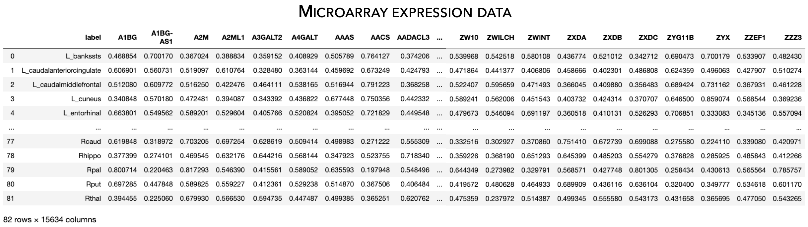

.. _gene_maps:

Gene expression data
======================================

This page contains descriptions and examples to load gene expression data!

Fetch gene expression data
--------------------------------------
The **ENGMA TOOLBOX** provides microarray expression data obtained from the `Allen Human Brain Atlas <https://human.brain-map.org/>`_.
Following the examples below, we can fetch microarray expression data.

.. Note::
     The Allen Human Brain Atlas microarray expression data loaded as part of the **ENIGMA TOOLBOX** was originally
     fetched from the `abagen <https://github.com/rmarkello/abagen>`_ toolbox using the ``abagen.get_expression_data()``
     command, using data from *all* donors. We then re-organized the rows (corresponding to region labels) to match the order 
     used in ENIGMA-derived data matrices!

.. Note:: 
     Please also note that two regions (right frontal pole and right temporal pole) in the Desikan-Killiany atlas were 
     not matched to any tissue sample and thus are filled with NaN values in the data matrix.

.. tabs::

   .. code-tab:: py
       
        >>> from enigmatoolbox.datasets import fetch_ahba

       >>> # Fetch gene expression data (output of fetch_ahba() is a dataframe)
       >>> df = fetch_ahba()

       >>> # However, if you prefer to use numpy, you can also extract the data as follows:
       >>> genex = df.iloc[:, 1:].to_numpy()

       >>> # Obtain the region labels
       >>> reglabels = df.iloc[:,0].to_list()

       >>> # As well as the gene labels
       >>> glabels = df.columns.values[1:].tolist()

   .. code-tab:: matlab

        %% ...  

