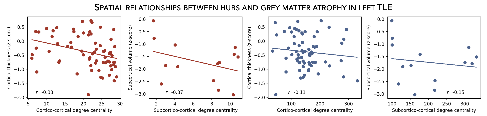

.. _hubs_susceptibility:

Hub susceptibility
======================================

This page contains descriptions and examples to build hub susceptibility models!

Cortical hubs
------------------------------------------
Using the :ref:`HCP connectivity data <surf_visualization>`, we can then compute weighted (optimal for unthresholded connectivity
matrices) degree centrality to identify structural and functional hub regions. This is done by simply 
computing the sum of all weighted cortico-cortical connections for every region. Higher degree centrality 
denotes increased hubness (*i.e.*, node with many connections). 

.. tabs::

   .. code-tab:: py
       
        >>> import numpy as np
        >>> import enigmatoolbox.datasets
        >>> from enigmatoolbox.plotting import plot_cortical
        >>> from enigmatoolbox.datasets import load_sc, load_fc
        >>> from enigmatoolbox.utils.parcellation import parcel_to_surface

        >>> # Load functional and structural cortico-cortical connectivity data
        >>> fc, _, _, _ = load_fc()
        >>> sc, _, _, _ = load_sc()

        >>> # Compute weighted degree centrality measures from the connectivity data
        >>> dc_f = np.sum(fc, axis=0)
        >>> dc_s = np.sum(sc, axis=0)

        >>> # Map parcellated data to the surface
        >>> dc_f_fsa5 = parcel_to_surface(dc_f, 'aparc_fsa5')
        >>> dc_s_fsa5 = parcel_to_surface(dc_s, 'aparc_fsa5')

        >>> # And project the results on the surface brain
        >>> plot_cortical(array_name=dc_f_fsa5, surface_name="fsa5", size=(800, 400),
        ...                 cmap='Reds', color_bar=True, color_range=(20, 30))

        >>> plot_cortical(array_name=dc_s_fsa5, surface_name="fsa5", size=(800, 400),
        ...               cmap='Blues', color_bar=True, color_range=(100, 300))

   .. code-tab:: matlab

        %% Load functional and structural cortico-cortical connectivity data
        [fc, ~, ~, ~]     = load_fc();
        [sc, ~, ~, ~]     = load_sc();

        %% Compute weighted degree centrality measures from the connectivity data
        dc_f                = sum(fc);
        dc_s                = sum(sc);

        %% Map parcellated data to the surface
        dc_f_fsa5           = parcel_to_surface(dc_f, 'aparc_fsa5');
        dc_s_fsa5           = parcel_to_surface(dc_s, 'aparc_fsa5');

        %% And project the results on the surface brain
        f = figure,
          plot_cortical(dc_f_fsa5, 'fsa5', 'functional degree centrality')
          colormap([Reds])
          SurfStatColLim([20 30])
     
        f = figure,
          plot_cortical(dc_s_fsa5, 'fsa5', 'structural degree centrality')
          colormap([Blues])
          SurfStatColLim([100 300]) 

.. image:: ./examples/example_figs/fc_hubs_ctx.png
    :align: center

|

Subcortical hubs
---------------------------------------------
The :ref:`HCP connectivity data <surf_visualization>` can also be used to identify structural 
and functional subcortico-cortical hub regions. As above, we simply compute the sum of all weighted 
subcortico-cortical connections for every subcortical area. Once again, higher degree centrality 
denotes increased hubness!

.. Attention:: 
     Because we do not have connectivity values for the ventricles, do make sure to set 
     the "ventricles" flag to ``False`` when displaying the findings on the subcortical surfaces!

.. tabs::

   .. code-tab:: py

        >>> import numpy as np
        >>> from enigmatoolbox.plotting import plot_subcortical
        >>> from enigmatoolbox.datasets import load_sc, load_fc

        >>> # Load functional and structural subcortico-cortical connectivity data
        >>> _, _, fc, _ = load_fc()
        >>> _, _, sc, _ = load_sc()

        >>> # Compute weighted degree centrality measures from the connectivity data
        >>> dc_f = np.sum(fc, axis=1)
        >>> dc_s = np.sum(sc, axis=1)

        >>> # And project the results on the subcortical surfaces (don't forget to set the ventricles flag to False!)
        >>> plot_subcortical(array_name=dc_f, ventricles=False, size=(800, 400),
        ...                  cmap='Reds', color_bar=True, color_range=(5, 10))

        >>> plot_subcortical(array_name=dc_s, ventricles=False, size=(800, 400),
        ...                  cmap='Blues', color_bar=True, color_range=(100, 300))

   .. code-tab:: matlab

        %% Add the path to the ENIGMA TOOLBOX matlab folder
        addpath(genpath('/path/to/ENIGMA/matlab/'));

        %% Load functional and structural subcortico-cortical connectivity data
        [~, ~, fc, ~]     = load_fc();
        [~, ~, sc, ~]     = load_sc();

        %% Compute weighted degree centrality measures from the connectivity data
        dc_f                = sum(fc, 2);
        dc_s                = sum(sc, 2);

        %% And project the results on the subcortical surfaces (don't forget to set the ventricles flag to 'False'!
        f = figure,
          plot_subcortical(dc_f, 'False', 'functional degree centrality')
          colormap([Reds])
          SurfStatColLim([5 10])
     
        f = figure,
          plot_subcortical(dc_s, 'False', 'structural degree centrality')
          colormap([Blues])
          SurfStatColLim([100 300])

.. image:: ./examples/example_figs/fc_hubs_sctx.png
    :align: center

|

Relations between hubs and morphological measures
-------------------------------------------------------
Now that we have established the spatial distribution of hubs in the brain, we can then assess 
whether there is a selective vulnerability of these hub regions that parallels syndrome-specific atrophy patterns.
For simplicity, in the following example, we will spatially correlate degree centrality measures to 
*z*-scored cortical thickness and subcortical volume measures (with lower values indicating greater 
atrophy relative to controls).

.. admonition:: Long code alert 🚨

     For completeness, we include code that has been detailed elsewhere (:ref:`loading example data <load_ct>`,
     :ref:`z-scoring data <surf_visualization>`, :ref:`re-ordering subcortical volume data <surf_visualization>`, 
     :ref:`computing degree centrality <hubs_susceptibility>`). If you're already comfortable with these steps, 
     feel free to simply skip right to the last section!
     
.. tabs::

   .. code-tab:: py

        >>> import numpy as np
        >>> from enigmatoolbox.datasets import load_example_data
        >>> from enigmatoolbox.utils.useful import zscore_matrix, reorder_sctx
        >>> from enigmatoolbox.datasets import load_sc, load_fc

        >>> """
        >>> 1 - Let's start by loading our example data
        >>> """
        >>> # Here we need the covariates, cortical thickness, and subcortical volume data
        >>> cov, metr1_SubVol, metr2_CortThick, _ = load_example_data()

        >>> # After loading our subcortical data, we must re-order them (alphabetically and by hemisphere)
        >>> # so to match the order from the connectivity matrices
        >>> metr1_SubVol_r = reorder_sctx(metr1_SubVol)

        >>> # We must also remove subcortical values corresponding the ventricles (as we don't have connectivity values for them!)
        >>> metr1_SubVol_r = metr1_SubVol_r.drop(columns=['LLatVent', 'RLatVent'])

        >>> """
        >>> 2 - We can then and z-score data in patients relative to controls, so that lower values
        >>>     correspond to greater atrophy          
        >>> """
        >>> # Z-score patients' data relative to controls (lower z-score = more atrophy)
        >>> group = cov['Dx'].to_list()
        >>> controlCode = 0
        >>> sv = zscore_matrix(metr1_SubVol_r.iloc[:, 1:-1], group, controlCode)
        >>> ct = zscore_matrix(metr2_CortThick.iloc[:, 1:-5], group, controlCode)

        >>> # Mean z-score values across individuals with left TLE (SDx == 3)
        >>> ct_tle = np.mean(ct.to_numpy()[cov[cov['SDx'] == 3].index, :], axis=0)
        >>> sv_tle = np.mean(sv.to_numpy()[cov[cov['SDx'] == 3].index, :], axis=0)

        >>> """
        >>> 3 - Let's then load our functional and structural connectivity matrices
        >>>     and compute degree centrality metrics to identify the spatial distribution 
        >>>     of hubs
        >>> """
        >>> # Load functional and structural cortico-cortical connectivity data (for simplicity, we won't load the regions' labels)
        >>> fc_ctx, _, fc_sctx, _ = load_fc()
        >>> sc_ctx, _, sc_sctx, _ = load_sc()

        >>> # Compute weighted degree centrality measures from the functional connectivity data
        >>> fc_ctx_dc = np.sum(fc_ctx, axis=0)
        >>> fc_sctx_dc = np.sum(fc_sctx, axis=1)

        >>> # Compute weighted degree centrality measures from the structural connectivity data
        >>> sc_ctx_dc = np.sum(sc_ctx, axis=0)
        >>> sc_sctx_dc = np.sum(sc_sctx, axis=1)

        >>> """
        >>> 4 - We can now perform spatial correlations between decreases in cortical thickness/
        >>>     subcortical volume and functional/structural degree centrality maps
        >>> """
        >>> # Perform spatial correlations between functional hubs and atrophy
        >>> fc_ctx_r = np.corrcoef(fc_ctx_dc, ct_tle)[0, 1]
        >>> fc_sctx_r = np.corrcoef(fc_sctx_dc, sv_tle)[0, 1]

        >>> # Perform spatial correlations between structural hubs and atrophy
        >>> sc_ctx_r = np.corrcoef(sc_ctx_dc, ct_tle)[0, 1]
        >>> sc_sctx_r = np.corrcoef(sc_sctx_dc, sv_tle)[0, 1]

        >>> # Let's check our correlation values
        >>> fc_ctx_r
        Out: -0.3262858710039119
        >>> fc_sctx_r
        Out: -0.3694570967953776
        >>> sc_ctx_r
        Out: -0.10906952508821116
        >>> sc_sctx_r
        Out: -0.15460373306487168

   .. code-tab:: matlab

        %% Add the path to the ENIGMA TOOLBOX matlab folder
        addpath(genpath('/path/to/ENIGMA/matlab/'));

|

Plot spatial correlations between hubs and morphological measures
------------------------------------------------------------------------
Now that we have done all the necessary analyses, we can finally display our correlations! 
Here, a negative correlation indicates that greater atrophy (negative z-score values) correlates 
with the spatial distribution of hub regions (greater degree centrality).  

.. tabs::

   .. code-tab:: py

        >>> import numpy as np
        >>> import matplotlib.pyplot as plt
        >>> import matplotlib.gridspec as gridspec

        >>> fig = plt.figure(constrained_layout=True, figsize=(15, 3))
        >>> gs = gridspec.GridSpec(1, 4, figure=fig)

        >>> # Functional cortical hubs and cortical thickness
        >>> ax1 = fig.add_subplot(gs[0, 0])
        >>> ax1.scatter(fc_ctx_dc, ct_tle, color='#A8221C')
        >>> m, b = np.polyfit(fc_ctx_dc, ct_tle, 1)
        >>> ax1.plot(fc_ctx_dc, m*fc_ctx_dc + b, color='#A8221C')
        >>> ax1.text(7, -1.88, '$r$=' + str(round(fc_ctx_r, 2)))
        >>> ax1.set_xlabel('Cortico-cortical degree centrality')
        >>> ax1.set_ylabel('Cortical thickness (z-score)')

        >>> # Functional subcortical hubs and subcortical volume
        >>> ax2 = fig.add_subplot(gs[0, 1])
        >>> ax2.scatter(fc_sctx_dc, sv_tle, color='#A8221C')
        >>> m, b = np.polyfit(fc_sctx_dc, sv_tle, 1)
        >>> ax2.plot(fc_sctx_dc, m*fc_sctx_dc + b, color='#A8221C')
        >>> ax2.text(3, -3, '$r$=' + str(round(fc_sctx_r, 2)))
        >>> ax2.set_xlabel('Subcortico-cortical degree centrality')
        >>> ax2.set_ylabel('Subcortical volume (z-score)')

        >>> # Structural cortical hubs and cortical thickness
        >>> ax3 = fig.add_subplot(gs[0, 2])
        >>> ax3.scatter(sc_ctx_dc, ct_tle, color='#324F7D')
        >>> m, b = np.polyfit(sc_ctx_dc, ct_tle, 1)
        >>> ax3.plot(sc_ctx_dc, m*sc_ctx_dc + b, color='#324F7D')
        >>> ax3.text(88, -1.88, '$r$=' + str(round(sc_ctx_r, 2)))
        >>> ax3.set_xlabel('Cortico-cortical degree centrality')
        >>> ax3.set_ylabel('Cortical thickness (z-score)')

        >>> # Structural subcortical hubs and subcortical volume
        >>> ax4 = fig.add_subplot(gs[0, 3])
        >>> ax4.scatter(sc_sctx_dc, sv_tle, color='#324F7D')
        >>> m, b = np.polyfit(sc_sctx_dc, sv_tle, 1)
        >>> ax4.plot(sc_sctx_dc, m*sc_sctx_dc + b, color='#324F7D')
        >>> ax4.text(250, -3, '$r$=' + str(round(sc_sctx_r, 2)))
        >>> ax4.set_xlabel('Subcortico-cortical degree centrality')
        >>> ax4.set_ylabel('Subcortical volume (z-score)')

        >>> plt.show()

   .. code-tab:: matlab

        %% Add the path to the ENIGMA TOOLBOX matlab folder
        addpath(genpath('/path/to/ENIGMA/matlab/'));

        %% 1 - Let's start by loading our example data
        % Here we need the covariates, cortical thickness, and subcortical volume data
        [cov, metr1_SubVol, metr2_CortThick, ~] = load_example_data();

        % After loading our subcortical data, we must re-order them (alphabetically and by hemisphere)
        % so to match the order from the connectivity matrices
        metr1_SubVol_r                          = reorder_sctx(metr1_SubVol);

        % We must also remove subcortical values corresponding the ventricles (as we don't have connectivity values for them!)
        metr1_SubVol_r.LLatVent                 = [];
        metr1_SubVol_r.RLatVent                 = [];

        %% 2 - We can then and z-score data in patients relative to controls, so that lower values
        %      correspond to greater atrophy
        % Z-score patients' data relative to controls (lower z-score = more atrophy)
        group        = cov.Dx;
        controlCode  = 0;
        sv           = zscore_matrix(metr1_SubVol_r(:, 2:end-1), group, controlCode);
        ct           = zscore_matrix(metr2_CortThick(:, 2:end-5), group, controlCode);

        % Mean z-score values across individuals with left TLE (SDx == 3)
        ct_tle       = mean(ct(find(cov.SDx == 3), :), 1);
        sv_tle       = mean(sv(find(cov.SDx == 3), :), 1);

        %% 3 - Let's then load our functional and structural connectivity matrices
        %        and compute degree centrality metrics to identify the spatial distribution
        %        of hubs
        % Load functional and structural cortico-cortical connectivity data (for simplicity, we won't load the regions' labels)
        [fc_ctx, ~, fc_sctx, ~]   = load_fc();
        [sc_ctx, ~, sc_sctx, ~]   = load_sc();

        % Compute weighted degree centrality measures from the functional connectivity data
        fc_ctx_dc                 = sum(fc_ctx, 1);
        fc_sctx_dc                = sum(fc_sctx, 2);

        % Compute weighted degree centrality measures from the structural connectivity data
        sc_ctx_dc                 = sum(sc_ctx);
        sc_sctx_dc                = sum(sc_sctx, 2);

        %% 4 - We can now perform spatial correlations between decreases in cortical thickness/
        %      subcortical volume and functional/structural degree centrality maps
        % Perform spatial correlations between functional hubs and atrophy
        fc_ctx_r     = corrcoef(fc_ctx_dc, ct_tle);
        fc_sctx_r    = corrcoef(fc_sctx_dc, sv_tle);

        % Perform spatial correlations between structural hubs and atrophy
        sc_ctx_r    = corrcoef(sc_ctx_dc, ct_tle);
        sc_sctx_r   = corrcoef(sc_sctx_dc, sv_tle);

        % Let's check our correlation values
        fc_ctx_r(1, 2)
        >> -0.3255
        fc_sctx_r(1, 2)
        >> -0.3695
        sc_ctx_r(1, 2)
        >> -0.1091
        sc_sctx_r(1, 2)
        >> -0.1546

