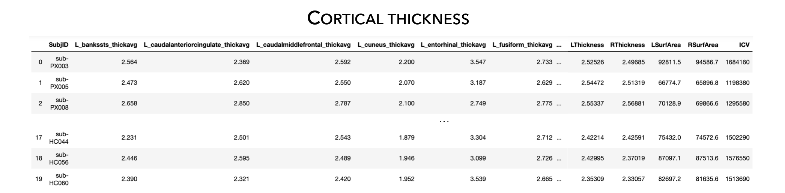

.. _load_ct:

Load example data
======================================

This page contains descriptions and examples to load our example data! 

This is an example dataset that includes 10 healthy controls (XX females, age±SD=XX.XX±XX.X) and 10 individuals with 
left-onset temporal lobe epilepsy (TLE, XX females, age±SD=XX.XX±XX.X).

Load covariates data
------------------------------------
As per ENIGMA-Epilepsy protocol, covariate information includes **SubjID** (subjectID),
**Dx** (diagnosis, 0=controls, 1=patients), **SDx** (sub-diagnosis, 0=controls,
1=non-lesional patients, 2=genetic generalized epilepsy (IGE/GGE) patients, 3=left TLE,
4=right TLE), **Age** (in years), **Sex** (1=males, 2=females), **Handedness** (1=right, 2=left),
**AO** (age at onset in years, patients only), **DURILL** (duration of illness in years, patients only),
and **ICV** (intracranial volume).

.. tabs::

   .. code-tab:: py
       
        >>> from enigmatoolbox.datasets import load_example_data
        >>> cov, _, _, _ = load_example_data()

   .. code-tab:: matlab

        %% ...  

|

Load subcortical volume data
------------------------------------
| ...

.. tabs::

   .. code-tab:: py
       
        >>> from enigmatoolbox.datasets import load_example_data
        >>> _, metr1_SubVol, _, _ = load_example_data()

   .. code-tab:: matlab

        %% ...  
.. image:: ./examples/example_figs/metr1.png
    :align: center

|

Load cortical thickness data
--------------------------------------
| ...

.. tabs::

   .. code-tab:: py
       
        >>> from enigmatoolbox.datasets import load_example_data
        _, _, metr2_CortThick, _ = load_example_data()

   .. code-tab:: matlab

        %% ...  

|

Load cortical surface area data
------------------------------------
| ...

.. tabs::

   .. code-tab:: py
       
        >>> from enigmatoolbox.datasets import load_example_data
        >>> _, _, _, metr3_CortSurf = load_example_data()

   .. code-tab:: matlab

        %% ...  
.. image:: ./examples/example_figs/metr3.png
    :align: center

|

Just load everything!
------------------------------------
You can also load all the example data into one simple command line!

.. tabs::

   .. code-tab:: py
       
        >>> from enigmatoolbox.datasets import load_example_data
        >>> cov, metr1_SubVol, metr2_CortThick, metr3_CortSurf = load_example_data()

   .. code-tab:: matlab

        %% ...  